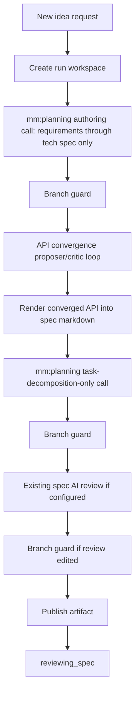

# Enhancement: Authoring API convergence

## Parent feature

Primary parent feature:
- `feature-idea-to-spec.md` — provides idea intake, `speccing`, mm:planning artifact authoring, human spec review, and feedback-driven spec revision.
Related specs that this enhancement extends or supersedes:
- `feature-approval-to-implementation.md` — provides the approved-spec to implementation lifecycle where the old implementation-phase altitude path currently runs.
- `enhancement-bounded-convergence-review.md` — provides the bounded proposer/critic convergence loop, role-aware routing, same-model guard, `gate_exchanges`, and journal enrichment that this enhancement reuses for API convergence.
- `enhancement-layered-diff-convergence.md` — introduced implementation-phase layout/public API/private API/build altitude passes. This enhancement supersedes the early implementation altitude passes by moving coarse API convergence into authoring.
- `enhancement-spec-ai-review-pass.md` — provides the internal spec review coordinator pattern and reinforces that spec quality gates happen before human review.
- `enhancement-append-only-backfill-journal.md` — provides durable `sessions.jsonl` and `feedback.jsonl` streams that this enhancement enriches with `gate: "api"`, role, and round metadata.
- `enhancement-run-status-workspace-ai-context.md` — surfaces active model request metadata while artifact authoring and convergence agents run.
- `enhancement-model-provider-config.md` and `feature-openai-agent-sdk-runner.md` — provide provider-neutral AI profiles, role-aware routing, and future provider compatibility.
GitHub issue: [#200 — Move convergence to the authoring phase: adversarial API convergence before task decomposition](https://github.com/markdstafford/autocatalyst-v0/issues/200)
## What

Autocatalyst can optionally change `speccing` from one end-to-end mm:planning call into an orchestrated authoring sequence. When authoring API convergence is enabled for a run, Autocatalyst asks mm:planning to write the spec only through the tech-spec stage, runs a bounded adversarial proposer/critic loop over a structured API artifact, writes the converged API into the spec markdown between the tech spec and task decomposition, and then asks mm:planning to run only task decomposition while respecting the agreed API. When the feature is disabled, `speccing` remains exactly the current one-call flow through task decomposition.
## Why

The implementation-phase layered altitude experiment runs too late. The implementation agent creates a full task-list implementation in one autonomous pass, so layout and API gates can only review code that already exists. Moving convergence to authoring gives the implementation plan a reviewed API contract before decomposition starts, which lets human reviewers approve or challenge the API before any code is built. The v0 version is deliberately coarse: one full-API convergence gate, lenient on non-convergence, no micromanager skill edits, and no build conformance enforcement.
## User stories

- As Enzo, I can enable authoring-phase API convergence so the spec includes an adversarially reviewed API before task decomposition.
- As Enzo, I can review the agreed API in the spec before approving implementation, instead of discovering API disagreements after code exists.
- As Phoebe, I can leave the feature off and receive the same spec-generation behavior as today.
- As an operator, I can configure the proposer and critic profiles separately and keep convergence off by default for safe rollout.
- As an analytics agent, I can inspect `sessions.jsonl`, `feedback.jsonl`, and `gate_exchanges` to see API convergence rounds, roles, findings, and the model profiles used.
- As an implementation agent, I receive a task list that was decomposed after the API surface was agreed, reducing guesswork during build.
- As Enzo, I can trust that reaching the API round cap does not fail the run; the current API is folded into the spec and reviewed by the human.
- As an operator, I can verify through integration tests that API convergence is actually wired into the `speccing` flow and injected through runtime composition.
## Design changes

This is a backend workflow enhancement. It does not add a new human UI, run stage, or primary interaction surface.
Human-visible behavior changes only in the generated spec:
- With authoring API convergence disabled, generated specs are unchanged.
- With it enabled, generated specs include an `## Converged API` section after the tech spec and before the task list.
- The final spec still moves to `reviewing_spec` through the existing publication flow.
- Humans still approve or reject the full spec through the existing spec review surface.
Progress updates should make the longer authoring flow understandable in Slack or any future human interface:
```plain text
Spec authoring started — drafting through tech spec
Tech spec draft complete — starting API convergence
API convergence round 1 started — proposer drafting API artifact
API critic returned 2 findings — revising API artifact
API convergence reached round cap — proceeding with current API
Converged API folded into spec — decomposing tasks
Task decomposition complete — publishing spec for review
```
Progress update failures are non-blocking and logged with `event: "progress_failed"`, `phase: "authoring_api_convergence"`, `run_id`, and the safe error string.
## Technical changes

### Affected files

- `src/types/config.ts` — add authoring-phase API convergence configuration types under a new spec-authoring or artifact-authoring policy block.
- `src/config/defaults.ts` and config normalization modules — resolve defaults with authoring API convergence disabled, max rounds default `5`, and same-model policy compatible with existing convergence behavior.
- `src/types/ai.ts` — add structured API artifact types, API convergence result types, optional `ArtifactAuthoringAgent` method contracts, and `AgentTaskKind` route keys if new route tasks are introduced.
- `src/core/ai/agent-services.ts` — split artifact creation prompts into full-spec, tech-spec-only, and task-decomposition-only variants; add API-specific propose, critique, and revise prompts; add structured API artifact parsing and markdown rendering helpers.
- `src/core/ai/authoring-api-convergence-coordinator.ts` — add a coordinator that runs proposer/critic API convergence, persists `gate_exchanges`, journals sessions and findings, handles max-round leniency, and renders the agreed API.
- `src/core/handlers/artifact-creation-handler.ts` — orchestrate the enabled `speccing` sequence for idea artifacts: tech-spec-only authoring, API convergence, spec mutation, task-decomposition-only authoring, branch guards, spec review, and publication.
- `src/core/handlers/artifact-feedback-handler.ts` — keep current revision behavior unchanged for v0 and add stale generated API cleanup for pre-approval artifact feedback; feedback revisions must not rerun the authoring API convergence coordinator in v0.
- `src/core/default-handler-registry.ts` — accept and inject the authoring API convergence coordinator into artifact creation only; v0 feedback handling must not receive or invoke the coordinator.
- `src/adapters/runtime-composition.ts` and `src/core/runtime-composition.ts` — construct the coordinator from runtime dependencies and pass it into the default handler registry.
- `src/core/ai/implementation-review-coordinator.ts` — stop using implementation-phase layered altitude orchestration for initial implementation while preserving build-level bounded review.
- `src/core/handlers/implementation-start-handler.ts` — remove or disable the `runLayeredImplementation` path so initial implementation no longer runs layout/public API/private API altitude passes.
- `src/core/ai/layered-convergence-policy.ts` — retire early implementation altitude depth selection or leave it unused behind compatibility helpers; keep build-level convergence policy intact.
- `src/core/ai/gate-context.ts`, `src/core/ai/git-checkpoints.ts`, `src/core/ai/altitude-contract-validator.ts`, and `src/core/ai/build-contract-preservation.ts` — remove if clean after disabling implementation altitude passes, or leave as dead code only if removal creates unnecessary churn.
- `src/core/journal/run-journal.ts`, `src/core/journal/model-session-budget.ts`, and `src/types/journal.ts` — ensure authoring API convergence sessions and critic findings are captured with `gate: "api"`, `role`, `round`, route/profile metadata, and critic principal attribution.
- `tests/core/ai/agent-services.test.ts` — cover new prompts, parse recovery, API artifact schema validation, markdown rendering, and mm:planning stop/resume instructions.
- `tests/core/ai/authoring-api-convergence-coordinator.test.ts` — cover convergence, max-round leniency, same-model guard, proposer/critic routing, parse failures, feedback capture, and markdown output.
- `tests/core/handlers/artifact-creation-handler.test.ts` — cover disabled one-call behavior and enabled orchestration order.
- `tests/adapters/runtime-composition.test.ts` or `tests/core/default-handler-registry.test.ts` — prove the convergence dependency is constructed and injected through runtime composition.
- `tests/core/handlers/implementation-start-handler.test.ts` — prove implementation no longer calls `runLayeredImplementation` and still runs build-level initial review.
- `tests/integration` or the nearest existing integration-style handler suite — add a wiring test that asserts proposer and critic are invoked inside `speccing` when enabled and the spec gains the API section.
- `autocatalyst.yaml` — document optional disabled-by-default config and any role-specific routes needed by the repository's runtime profile set.
### Changes

#### 1. Prerequisites and assumptions

- ADR-001 requires agent-first implementation and agent-queryable diagnostics.
- ADR-002 places human-reviewed specs in `context-human/specs/` and agent-owned technical notes in `context-agent/`.
- ADR-003 makes the Markdown spec the canonical artifact consumed by implementation.
- ADR-004 and the handler-registry decision keep scheduling and route dispatch centralized outside individual handlers.
- The existing artifact creation path already runs in `speccing`, writes a local spec file, runs branch guards, optionally runs spec review, publishes the artifact, and transitions to `reviewing_spec`.
- The existing implementation review coordinator already has bounded proposer/critic convergence, same-model enforcement, role-aware routing, `gate_exchanges`, and journal feedback emission that can be reused or factored into a smaller shared helper.
- No new database, external API endpoint, human UI, or run stage is required.
- No micromanager skill files may be edited. mm:planning is controlled only through prompts.
- The enabled design has two prompt-only mm:planning control assumptions, and both are load-bearing: first, mm:planning must stop after the tech-spec stage without decomposing tasks while still leaving a canonical empty top-level `## Task list` placeholder; second, mm:planning must later resume at task decomposition only without re-authoring requirements, design, or tech spec.
- The first implementation step must be a tiny real-runner prompt spike that validates both boundaries and the required `## Task list` placeholder with the actual mm:planning runner before building the coordinator, artifact parser, config wiring, or runtime composition.
- If either prompt-only boundary proves unreliable in the spike or later real execution, the implementer must stop and report the blocker rather than modifying mm:planning or continuing with coordinator work that depends on the assumption.
#### 2. Configuration and rollout

Add a disabled-by-default policy for authoring-phase API convergence. The exact nesting is the implementer's call, but it must not reuse `implementation_review.convergence.depth` because that field describes implementation review behavior. A clear v0 shape is:
```yaml
spec_authoring:
  api_convergence:
    enabled: false
    max_rounds: 5
    allow_same_model: false
```
Rules:
- Missing `spec_authoring.api_convergence.enabled` means `false`.
- Missing `max_rounds` means `5`.
- `max_rounds` must be a positive integer.
- Missing `allow_same_model` means `false`.
- With `enabled: false`, `ArtifactCreationHandler` must call `artifactAuthoringAgent.create()` exactly as it does today for idea artifacts.
- With `enabled: true`, only idea/feature-spec creation uses the new sequence. Bug triage, chore plans, issue filing, implementation planning, implementation, and final review keep their existing behavior unless explicitly noted below.
- Role-specific routing should mirror existing convergence style. If new route tasks are added, use names that make the design phase clear, such as `artifact.api.propose` and `artifact.api.critique`. If existing `artifact.create` / `spec.review` route tasks are reused, the route must include `role: "proposer"` or `role: "critic"` and session capture must record the role.
- Proposer and critic must resolve to distinct profile IDs unless `allow_same_model: true`.
- The feature must be switchable per run through the resolved config available when `speccing` starts.
Legacy implementation convergence depth after retiring issue 198:
- Existing configs may still contain `implementation_review.convergence.depth: full`, `public_api`, `private_api`, or `layout`.
- After this enhancement retires implementation-phase altitude passes, `depth` is a legacy compatibility field for early altitude selection only. It must not cause layout/public/private API gates to run.
- The resolver must keep existing configs valid and degrade them to build-level convergence behavior. When `implementation_review.convergence.enabled` is true, build-level initial/final review still runs; when it is false, implementation review remains disabled as before.
- Non-build `depth` values should be accepted but ignored for altitude orchestration and should emit a safe structured compatibility warning, such as `implementation_review.convergence.depth_ignored`, with the configured value and the effective behavior `build_only`. This avoids surprising silent no-ops while preserving backwards compatibility.
- New documentation and config examples should stop presenting `depth` as an active control. If a schema field remains for compatibility, mark it deprecated/ignored.
#### 3. Disabled flow compatibility

The disabled path is a compatibility contract, not only a config default.
When the feature is off:
1. `ArtifactCreationHandler` transitions the run to `speccing`.
2. It creates the workspace and branch exactly as today.
3. It invokes `artifactAuthoringAgent.create(request, workspace_path, onProgress, undefined, telemetry)` once for idea artifacts.
4. The generated prompt still says `Use the mm:planning skill to create a complete product spec` and allows mm:planning to run through task decomposition.
5. Branch guard, spec review, publication, status update, and transition to `reviewing_spec` stay in the existing order.
6. No API convergence coordinator is called.
7. No `gate: "api"` sessions, findings, or `gate_exchanges` are written.
Tests must assert the create-call count and arguments for the disabled path. If byte-for-byte prompt equality is practical, assert it. If not, assert the exact prompt builder output used by the disabled path is unchanged.
#### 4. Enabled `speccing` lifecycle

When the feature is on for an idea artifact, `speccing` becomes:

Lifecycle rules:
- The first mm:planning prompt must clearly say: author requirements, design if applicable, and tech spec; create a canonical empty top-level `## Task list` placeholder; stop after the tech spec; do not run task decomposition; write the normal result JSON only after the tech-spec-stage draft exists.
- The first call still writes a valid spec file at the requested artifact path. It must contain the canonical `## Task list` heading as an empty placeholder, but it must not contain decomposed implementation tasks.
- The API convergence loop reads the current spec file after the first branch guard.
- The folded API markdown is inserted at top-level heading `## Converged API` between the tech spec and task list. The insertion helper must find the first top-level `## Task list` heading and insert the generated API section immediately before it. Missing `## Task list` is fatal for v0 because there is no safe, template-conformant insertion point; the helper must fail clearly before task decomposition resumes rather than appending the section heuristically.
- The second mm:planning prompt must clearly say: run only the task-decomposition stage on the existing spec, preserve the existing requirements/design/tech/converged API sections, respect the agreed API surface, and write the result JSON after tasks are added.
- The second call must not re-run requirements, design, or tech spec from scratch except for minimal edits needed to make the task list consistent with the converged API.
- Existing spec review still runs after branch guard and before publication.
- Any branch drift fails the run using the current branch guard behavior.
Safe insertion algorithm:
1. Parse the spec as Markdown headings, ignoring fenced code blocks.
2. If an existing generated top-level `## Converged API` section is present, remove that section through the next top-level `##` heading before inserting the replacement.
3. Find the first top-level heading whose normalized text is exactly `Task list`. This canonical `## Task list` heading is the only acceptable insertion point for v0.
4. Insert the rendered `## Converged API` section immediately before that task-list heading.
5. If no canonical task-list heading exists, abort with an actionable error that says the spec is missing the required `## Task list` insertion point. The missing heading is not recoverable by appending after the tech spec because that can break the canonical mm:planning template order.
#### 4.1 Artifact feedback handling in v0

Feedback-driven spec revision remains intentionally conservative in v0:
- `ArtifactFeedbackHandler` must not rerun the authoring API convergence coordinator during human feedback revisions, even when `spec_authoring.api_convergence.enabled` is true.
- Before asking mm:planning to revise a pre-approval spec in response to artifact feedback, the handler must remove any existing generated top-level `## Converged API` section from the draft. This avoids preserving an API contract that may have been invalidated by human feedback to requirements, design, or tech spec.
- The feedback revision prompt should tell mm:planning that any prior generated API convergence section was removed because feedback may invalidate it, and that it should revise the spec using the normal feedback path rather than inventing a replacement `## Converged API` section.
- If a future configured reconvergence mode is added, it must be specified separately. This v0 enhancement does not include it.
- The cleanup must use the same fenced-code-aware heading parser as the insertion helper and must remove only the generated top-level `## Converged API` section through the next top-level `##` heading.
- Emit a safe structured warning or telemetry event, for example `artifact.api_convergence.stale_section_removed`, with `run_id`, `request_id`, and no raw prompt or secret-bearing content.
#### 5. Structured API artifact

The proposer emits an intermediate structured API artifact. Keep the schema coarse and parseable:
```typescript
export interface ConvergedApiArtifact {
  files: Array;
  public_api: Array;
    returns: string;
    errors: string[];
  }>;
  types: Array;
  notes: string;
}
```
Validation rules:
- `files`, `public_api`, and `types` must be arrays. Empty arrays are valid only when the spec truly has no code-facing API changes, and the proposer must explain that in `notes`.
- File paths must be repository-relative POSIX paths.
- `symbol`, `signature`, `returns`, `name`, and `shape` must be non-empty strings where applicable.
- `errors` must be an array of strings. Use `[]` when no error contract is expected.
- Unknown fields are ignored for forward compatibility.
- Invalid JSON or invalid shape consumes one API artifact attempt and causes a proposer-revision round when budget remains. It should not silently fold malformed data into the spec.
The final committed form is Markdown, not JSON. Render the artifact as:
```javascript
[section begins with the literal heading: ## Converged API]

### Files

| Path | Purpose | Exports |
|---|---|---|
| `src/example.ts` | ... | `symbolA`, `TypeB` |

### Public API

#### `symbolA`

```
export function symbolA(input: Input): Result
```javascript

- Parameters:
  - `input: Input` — ...
- Returns: `Result`
- Errors:
  - `ConfigError` when ...

### Types

#### `TypeB`

```
type TypeB = ...
```javascript

### Notes

...
```
- [ ] Any skipped provider/integration tests are documented with exact reason.
- **Dependencies**: "Task: Add speccing integration coverage", "Task: Clean up or quarantine dead layered modules"