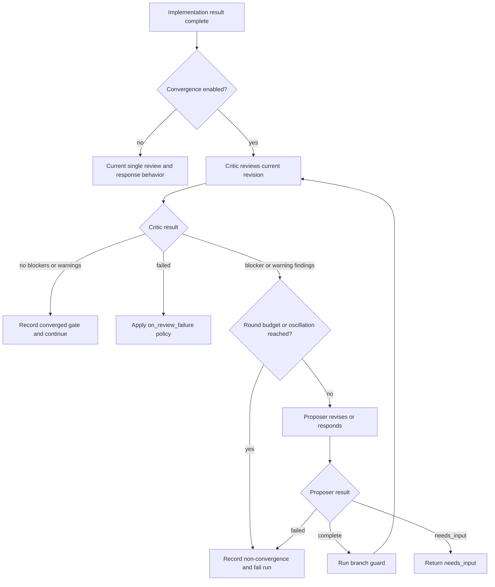

# Enhancement: Bounded convergence implementation review

## Parent feature

Primary parent feature:
- `feature-approval-to-implementation.md` — provides the implementation lifecycle, human testing guide, implementation approval path, and terminal run states.
Related specs that this enhancement extends or interlocks with:
- `enhancement-two-part-implementation-review.md` — adds initial and final implementation review checkpoints, reviewer findings, implementer responses, and `run.review_exchanges`.
- `enhancement-model-provider-config.md` and `feature-openai-agent-sdk-runner.md` — provide provider-neutral AI profiles and route-based model selection.
- `enhancement-append-only-backfill-journal.md` — provides durable `sessions.jsonl` and `feedback.jsonl` streams that this enhancement enriches with role and round metadata.
- `enhancement-run-status-workspace-ai-context.md` — surfaces active model request metadata while implementation and review agents are running.
GitHub issue: [#193 — Generalize implementation review into a bounded convergence loop with role-distinct routing](https://github.com/markdstafford/autocatalyst-v0/issues/193)
## What

Autocatalyst turns implementation review from a one-pass challenge into a bounded convergence loop. The existing reviewer still inspects the implementation after an implementation pass and before human handoff or PR creation. When the reviewer finds blockers or warnings, the implementer revises or explains the implementation, and the reviewer then reviews the current revision again. The loop stops when the latest critic result has no blocker or warning findings, when the configured round budget is exhausted, or when the system detects oscillation.
The critic may still return info-only findings for optional notes, but those findings do not block convergence. The preferred critic behavior is to return `status: "no_findings"` when no blocker or warning findings remain; if a provider returns `status: "findings"` with only `info` severity items, Autocatalyst records those notes and treats the gate as converged.
The enhancement also adds role-aware model routing. A route may resolve by `task:role`, such as `implementation.review.initial:critic` or `implementation.run:proposer`, and falls back to the current task-only key when no role-specific route exists. This keeps current configs working while allowing operators to make proposer and critic model choices explicit.
The feature is config-gated and off by default. With convergence disabled, implementation review behaves like today: one reviewer pass, one implementer response when findings exist, no re-review of that response, and task-only route fallback.
## Why

Autocatalyst already uses distinct models adversarially: one model implements and another model reviews. The gap is that the loop does not converge. Today the reviewer runs once, the implementer responds once, and Autocatalyst proceeds without asking the reviewer whether the response fixed the current code.
That behavior lets a model patch and ship instead of iterating to agreement. It also means configured round limits are validated but not enforced at runtime. A bounded convergence loop makes the existing review feature match its intent: reviewer blocker and warning findings must be resolved on the current revision or the run fails with an auditable record.
Role-aware routing gives the loop a stable foundation for future convergence work. Later work can add more gates and altitudes, but this issue proves the mechanism at the current build-level implementation review checkpoint.
## User stories

- As Enzo, I can enable convergence for implementation review and know the critic re-reviews the implementer's latest revision before human handoff.
- As Enzo, I can see a run fail when review findings do not converge within the configured round budget.
- As Enzo, I can inspect the testing guide and see each review round, findings, implementer responses, and whether the gate converged.
- As Phoebe, I can understand from the testing guide whether AI review converged without reading raw model transcripts.
- As an operator, I can configure proposer and critic profiles by role while preserving old task-only routing keys.
- As an operator, I receive a clear configuration error if proposer and critic resolve to the same profile without an explicit override.
- As an operator, I can leave convergence disabled and get behavior identical to today's single-pass review.
- As an analytics agent, I can read `sessions.jsonl` and distinguish model sessions by `role`, `round`, `gate`, route task, and profile.
- As an importer implementer, I can read `feedback.jsonl` and identify critic-authored findings with stable attribution and lifecycle disposition.
## Design changes

This is a backend workflow enhancement. It adds no new primary UI. The existing implementation testing guide gains richer AI review history when convergence is enabled.
### Goals

- Re-review the implementer's current revision after reviewer blocker or warning findings are addressed.
- Stop a review gate only when the current reviewer result has no blocker or warning findings, or when a bounded failure condition is reached.
- Enforce `implementation_review.max_initial_rounds` and `implementation_review.max_final_rounds` at runtime.
- Fail the run on non-convergence instead of continuing with unresolved blocker or warning findings or escalating to the human.
- Detect finding oscillation so taste disagreements or non-shrinking churn do not burn the entire round budget.
- Add optional `AgentRoute.role` and route lookup by `task:role`, with fallback to the current task-only lookup.
- Enforce distinct proposer and critic profiles within a review gate unless an explicit single-model override is configured.
- Preserve backward compatibility for existing runs, configs, `review_exchanges`, and testing-guide rendering.
- Persist convergence history with gate, round, proposer profile, critic profile, findings, responses, and convergence status.
- Add `role` and `round` to journal session records for proposer and critic sessions, and write AI review findings to `feedback.jsonl` with critic attribution.
- Add per-round structured logs for diagnosis and cost/latency analysis.
### Non-goals

- Adding layout, public API, private API, or other altitude-specific gates.
- Adding a staged implementer, layered diffs, or multi-step build plans beyond the current implementation agent flow.
- Adding new `RunStage` values or changing `VALID_RUN_STAGES`.
- Adding multi-critic fan-out, voting, or consensus protocols.
- Replacing human implementation approval.
- Giving the critic model write access or authority to decide what ships.
- Building a new UI for convergence history beyond existing testing-guide and journal surfaces.
- Guaranteeing role isolation at the provider sandbox level. Autocatalyst can enforce routing and prompt boundaries, but provider-level runtime isolation depends on the runner/provider.
### Personas and narratives

- **Enzo: Engineer/operator** — wants reviewer findings to be rechecked on the latest code before he tests or approves a PR.
- **Phoebe: Product manager** — wants the testing guide to show whether the AI review converged or failed, without needing to read raw logs.
- **Autocatalyst operator** — configures model profiles and needs clear errors when proposer and critic routing collapses to the same model unexpectedly.
- **Analytics agent** — reads journals later to compare cost, latency, and quality by role, round, gate, and model profile.
A review can converge after one revision: Enzo approves a spec and Autocatalyst implements it. The initial critic finds a blocker because the code handles the happy path but misses a regression test for invalid provider config. Autocatalyst asks the proposer to respond. The proposer adds the missing test and updates the implementation result. Instead of handing the work to Enzo immediately, Autocatalyst runs the critic again on the current revision. The critic returns `no_findings`. The testing guide shows two rounds: round 1 had one blocker and a fixed response, and round 2 converged. Enzo starts testing with more confidence because the reviewer checked the actual revision he is about to test.
A review can fail instead of shipping unresolved work: a final review finds a security issue before PR creation. The proposer declines it as not applicable. The critic re-reviews and returns the same blocker because the code still exposes the risky behavior. The round budget is reached. Autocatalyst fails the run and records the open finding, the proposer response, and both model profiles. It does not open a PR and does not ask the human to arbitrate in the live loop. Enzo debugs from the recorded state when he has time.
Routing stays compatible while roles become explicit. An existing repository may only have task-level routes:
```yaml
ai:
  routing:
    implementation.run: grove-sonnet-4.6-medium
    implementation.review.initial: grove-gpt-5.5-high
```
After upgrade, the same config still resolves because `task:role` lookup falls back to `task`. An operator who wants more control can add:
```yaml
ai:
  routing:
    implementation.run: grove-sonnet-4.6-medium
    implementation.run:proposer: grove-sonnet-4.6-medium
    implementation.review.initial:critic: grove-gpt-5.5-high
```
The journal now records `role: "proposer"` for proposer sessions and `role: "critic"` for critic sessions. The analytics agent can compare cost and outcomes by role without inferring roles from task names.
### Review gate lifecycle

The implementation review coordinator keeps its current placement inside implementation handlers. It does not become a new run stage.

A review gate is the existing review phase: `initial` or `final`. In this issue, both gates operate at the current build lens only. Later altitude work can reuse the same gate history shape with additional gate names.
### Convergence rules

- A gate converges when a critic round on the current revision returns no blocker or warning findings.
- `status: "no_findings"` always converges.
- `status: "findings"` with only `info` findings also converges; Autocatalyst records the notes but does not treat them as open blocking work.
- A gate does not converge if the critic returns blocker or warning findings through `max_rounds`.
- The preferred critic behavior is to return `no_findings` when only optional notes remain.
- A reviewer `status: "failed"` is still governed by `implementation_review.on_review_failure`.
- A proposer `status: "needs_input"` returns the normal awaiting-input behavior.
- A proposer `status: "failed"`, branch-guard failure, max-round exhaustion, or oscillation failure returns `ImplementationResult.status: "failed"` so the handler fails the run.
### Round limits and feature gate

Add an explicit convergence gate under `implementation_review`:
```yaml
implementation_review:
  convergence:
    enabled: false
    allow_same_model: false
  max_initial_rounds: 2
  max_final_rounds: 2
  on_review_failure: warn
  retest_on_behavior_change: true
```
Rules:
- Missing `implementation_review.convergence.enabled` means `false`.
- With convergence disabled, behavior matches today exactly, including a single reviewer pass and one proposer response when findings exist.
- With convergence enabled, `max_initial_rounds` and `max_final_rounds` are enforced as the maximum number of critic rounds for the matching gate.
- If a max value is absent while convergence is enabled, default to `2` for both gates. This keeps cost bounded while allowing one revision and one re-review by default.
- The only today-equivalent mode is convergence disabled. That disabled path remains the safe rollout setting for repositories that want current behavior: one critic pass, one proposer response when findings exist, and no re-review of that response.
- With convergence enabled, `max_rounds: 1` is valid but intentionally strict: Autocatalyst runs one critic round only. If that first critic round has any blocker or warning findings, the gate fails as non-converged immediately; no proposer response runs because there is no remaining critic round to verify it. Use this for strict single-pass gating and regression tests, not for today-equivalent rollout.
- Recommended rollout is disabled first, then enabled with `max_initial_rounds: 2` and `max_final_rounds: 2` so the proposer gets one chance to respond and the critic gets one re-review.
- `allow_same_model` defaults to `false`. If proposer and critic resolve to the same profile and this value is false, the run fails with a clear configuration error before starting the gate.
The configuration is evaluated per review gate invocation, so each run can execute with the policy active at the time that run reaches implementation review. If a later command-level per-run override exists, it should feed the same resolved policy; this issue does not require a new human command surface.
### Role-aware routing

Add optional `role` to `AgentRoute`:
```typescript
export type AgentRole = 'proposer' | 'critic';

export interface AgentRoute {
  task: AgentTaskKind;
  role?: AgentRole | string;
  stage?: RunStage | 'new_thread' | string;
  intent?: Intent;
  artifact_kind?: ArtifactKind;
}
```
`DefaultAgentRoutingPolicy` resolves routes with this order:
1. If `route.role` exists, look up `${route.task}:${route.role}`.
2. If no role-specific profile exists, look up `route.task`.
3. If no task-level profile exists, keep the current required/optional behavior: `resolve()` throws and `resolveOptional()` returns `null`.
This is non-breaking because all existing route keys are still task-level keys.
Route construction in the convergence path uses:
- Proposer route: `{ task: 'implementation.run', role: 'proposer' }`.
- Initial critic route: `{ task: 'implementation.review.initial', role: 'critic' }`.
- Final critic route: `{ task: 'implementation.review.final', role: 'critic' }`, with the existing final-to-initial fallback preserved.
The proposer review-response implementation must use the role-aware route in the actual agent invocation, not only in preflight comparison. The coordinator should either pass `agentRoute: { task: 'implementation.run', role: 'proposer' }` through to the existing implementation-agent/agent-service call that performs review-response work, or pass a resolved proposer profile plus route metadata produced from that route. Existing call signatures that only accept the task-only `implementation.run` route must be extended so convergence review-response sessions can select `implementation.run:proposer` when configured and record that same route/profile in session capture. Tests must assert the proposer review-response agent call and captured session use the role-specific route/profile when `implementation.run:proposer` is configured, and fall back to task-only `implementation.run` only when no role-specific route exists.
### Same-model enforcement

For each gate, compare resolved proposer and critic profiles before the first critic round.
Profiles are considered the same when they resolve to the same profile ID. If profile IDs differ but provider/model/base URL are identical, log a warning because the operator may still have configured two aliases for the same model. The hard failure is profile-ID equality unless future implementation chooses a stricter comparator and updates tests accordingly.
When same-profile routing is detected and `allow_same_model` is false, fail the run with an error such as:
```plain text
Implementation review convergence requires distinct proposer and critic profiles for initial review. Both resolved to grove-sonnet-4.6-medium. Configure implementation.run:proposer and implementation.review.initial:critic differently, or set implementation_review.convergence.allow_same_model: true.
```
### Oscillation guard

The guard detects non-shrinking or cycling blocker and warning findings. It should be simple, deterministic, and cheap.
For each critic round, compute a finding signature from blocker and warning findings only:
```plain text
severity|category|normalized finding text
```
Normalization lowercases text, trims whitespace, collapses internal whitespace, and strips volatile IDs. Suggested actions are excluded from the signature so a critic cannot appear to make progress by rewording advice while preserving the same issue.
Trigger non-convergence when either condition is true:
- The same blocking signature set appears in two critic rounds with no decrease in blocker+warning count after a proposer response.
- The blocker+warning count increases for two consecutive critic rounds after proposer responses.
On oscillation, record the latest open blocker and warning findings and fail the run with a non-convergence error. Do not continue burning remaining rounds. `info` findings alone do not contribute to oscillation detection.
### Persistence model

Keep `run.review_exchanges` for backward compatibility. Add `run.gate_exchanges` as an additive field that captures convergence-specific history.
```typescript
export interface GateReviewExchange {
  id: string;
  gate: 'initial' | 'final' | string;
  round: number;
  created_at: string;
  proposer_profile: AgentProfileSummary;
  critic_profile: AgentProfileSummary;
  review_status: ImplementationReviewExchangeStatus | 'non_converged' | 'converged';
  review_summary: string;
  findings: ImplementationReviewFinding[];
  responses: ImplementationReviewResponseItem[];
  converged: boolean;
  non_convergence_reason?: 'max_rounds' | 'oscillation';
  requires_human_retest: boolean;
}

export interface Run {
  review_exchanges?: ImplementationReviewExchange[];
  gate_exchanges?: GateReviewExchange[];
}
```
Compatibility rules:
- Existing `review_exchanges` readers continue to work.
- When convergence is disabled, Autocatalyst may write only `review_exchanges` as today.
- When convergence is enabled, Autocatalyst writes `gate_exchanges` for each critic round. `gate_exchanges` is the single source of truth for convergence feedback emission to `feedback.jsonl`.
- When convergence is enabled, Autocatalyst may also append a summarized legacy `review_exchanges` entry so current testing-guide rendering remains useful until it reads `gate_exchanges` directly. That legacy entry is rendering-only for convergence runs and must be excluded from journal feedback capture so critic findings are not written twice.
- Existing stored runs without `gate_exchanges` load without migration.
### Testing guide rendering

When `gate_exchanges` exists, the AI review section groups by gate and round:
```markdown
AI review

### Initial review

Convergence: converged
Rounds: 2
Proposer model: `grove-sonnet-4.6-medium`
Critic model: `grove-gpt-5.5-high`

#### Round 1 — findings

- [x] [INIT-1] Missing regression test for invalid provider config.
  Fixed — added coverage for unknown profile routing.

#### Round 2 — converged

- No blocker or warning findings.
```
For non-convergence:
```markdown
### Final review

Convergence: failed (`max_rounds`)
Rounds: 2

#### Open findings

- [ ] [FINAL-2] Security check still allows raw token output in logs.
  Last proposer response: Declined — token is only a config name.
```
Rules:
- Hide raw prompts, raw model transcripts, secrets, and chain-of-thought.
- Preserve stable finding IDs from critic results.
- Show concise proposer responses for each finding.
- Existing `review_exchanges` rendering remains the fallback when no `gate_exchanges` exists.
- Info-only findings may be shown as notes, but they must not be rendered as open blocking work when no blocker or warning findings remain.
### Journal interlock

Convergence enriches the journal from `enhancement-append-only-backfill-journal.md`.
`sessions.jsonl` additions:
- Critic sessions write `role: "critic"`, the current `round`, and `gate: "initial"` or `"final"`.
- Proposer review-response sessions write `role: "proposer"`, the round they are responding to, and the same gate.
- Existing non-convergence model sessions may keep `role: null` and `round: 1`.
`feedback.jsonl` additions:
- For convergence-enabled gates, feedback capture reads from `gate_exchanges` only. The legacy `review_exchanges` feedback capture added by `enhancement-append-only-backfill-journal.md` must be suppressed for rendering-only convergence summaries.
- Each critic finding writes a feedback record with the critic profile as `author_principal`.
- `target` is `"implementation"`.
- `category` and `severity` come from the finding.
- `disposition` uses the existing journal enum from `enhancement-append-only-backfill-journal.md`: fixed/addressed findings become `addressed`, declined findings become `wont_fix`, and open non-converged blocker or warning findings remain `open`.
- Info-only findings may be recorded as non-blocking notes with `disposition: "addressed"` when the gate converges, and must not force an open non-converged disposition.
- Capture happens at append time or dedupes by stable gate-exchange/finding ID so retries do not duplicate records. If implementation keeps both `gate_exchanges` and legacy `review_exchanges` eligible for capture for any reason, both paths must share an explicit stable finding ID dedup key and tests must prove a finding appears in `feedback.jsonl` only once.
### Progress updates

Post best-effort progress messages through the existing progress callback:
```plain text
Initial review round 1 started with grove-gpt-5.5-high
Initial review round 1 returned 2 findings — asking proposer to revise
Initial review round 2 started with grove-gpt-5.5-high
Initial review converged after 2 rounds
Final review did not converge after 2 rounds — failing run
```
Failed progress sends must not fail the run. They log `progress_failed` with phase, gate, round, and run ID.
### Cost and latency ceiling

Each convergence round can add one critic session and, when blocker or warning findings exist, one proposer session. With `max_initial_rounds: 2` and `max_final_rounds: 2`, a run can add up to four critic sessions and up to two proposer response sessions across both gates, depending on where blocking findings appear.
Because v0 has seen gateway timeouts on long calls, convergence must remain bounded. Operators should start with `max_*_rounds: 2`. Higher values require explicit configuration and should be monitored through per-round logs and journal session records.
### Risks and mitigations

- **Risk: Convergence increases cost and latency.** Mitigation: keep convergence off by default, enforce positive finite max rounds, recommend a default of 2 when enabled, and log/journal per-round usage.
- **Risk: The loop gets stuck in taste disagreement.** Mitigation: use an oscillation guard and fail with recorded state instead of burning the remaining budget.
- **Risk: Same-model routing silently weakens adversarial review.** Mitigation: fail same-profile proposer/critic routing by default and require an explicit override for single-model operation.
- **Risk: Backward compatibility breaks testing-guide or run-store readers.** Mitigation: add `gate_exchanges` as optional, keep `review_exchanges`, and use legacy rendering when gate history is absent.
- **Risk: Role-specific routing creates confusing config errors.** Mitigation: keep task-level fallback, use clear error messages, and test both `resolve()` and `resolveOptional()` paths.
- **Risk: Providers cannot enforce critic read-only behavior.** Mitigation: treat critic authority as logical only: prompts and runner wiring instruct review-only behavior, branch guard detects unexpected branch changes after proposer work, and provider-level sandbox limits remain runner-specific.
## Technical changes

### Affected files

- `src/types/ai.ts` — add `AgentRoute.role`, an `AgentRole` union, gate exchange types, and role/round/gate fields on session capture data if they are not already available through journal types.
- `src/types/runs.ts` — add optional `gate_exchanges?: GateReviewExchange[]` to `Run`.
- `src/types/config.ts` — add typed `implementation_review.convergence` config with `enabled` and `allow_same_model`.
- `src/core/config.ts` — validate and resolve convergence policy; preserve current review policy defaults when convergence is disabled, and resolve absent max-round values to `2` for both gates when convergence is enabled.
- `src/core/ai/routing-policy.ts` — implement `task:role` lookup with task-level fallback for both required and optional resolution.
- `src/core/ai/implementation-review-coordinator.ts` — replace the single-round implementation with the bounded convergence loop when enabled; enforce max rounds, same-model checks, oscillation guard, role-aware proposer/critic route resolution, session capture metadata, gate exchange persistence, and non-convergence failure.
- `src/core/ai/agent-services.ts` — update review and proposer-response prompts only as needed to include gate and round context; extend proposer review-response call parameters to accept a role-aware `AgentRoute` or pre-resolved proposer profile, and preserve existing structured result contracts.
- `src/core/handlers/implementation-start-handler.ts` — pass journal/session capture through with gate and round values, and fail the run when the coordinator returns non-convergence failure.
- `src/core/handlers/implementation-feedback-handler.ts` — same as implementation start for feedback passes.
- `src/core/handlers/implementation-approval-handler.ts` — same as implementation start for final review before PR creation.
- `src/types/impl-feedback-page.ts` — allow testing-guide update inputs to include `gate_exchanges`.
- `src/adapters/notion/implementation-feedback-page.ts` — render round-by-round gate history when present, with legacy fallback.
- `src/core/journal/run-journal.ts` and `src/types/journal.ts` — ensure `role`, `round`, and `gate` are stored for convergence sessions and feedback records map critic findings correctly.
- `tests/core/ai/implementation-review-coordinator.test.ts` — add convergence, max-round, oscillation, same-model, routing-role, and legacy-disabled tests.
- `tests/core/ai/routing-policy.test.ts` or equivalent — cover `task:role` lookup and fallback.
- `tests/core/config.test.ts` — cover convergence config validation and defaults.
- `tests/core/handlers/implementation-start-handler.test.ts`, `implementation-feedback-handler.test.ts`, and `implementation-approval-handler.test.ts` — cover handler-level failure and success behavior.
- `tests/adapters/notion/implementation-feedback-page.test.ts` — cover gate exchange rendering.
- `tests/core/journal/run-journal-facade.test.ts` — cover role, round, gate, and AI finding feedback persistence.
### Config resolver

Extend the resolved review policy used by the coordinator:
```typescript
export interface ImplementationReviewConvergencePolicy {
  enabled: boolean;
  allow_same_model: boolean;
}

export interface ImplementationReviewPolicy {
  max_initial_rounds: number;
  max_final_rounds: number;
  on_review_failure: 'warn' | 'block';
  retest_on_behavior_change: boolean;
  convergence: ImplementationReviewConvergencePolicy;
}
```
Validation rules:
- `implementation_review.convergence` must be an object when present.
- `enabled` must be boolean when present.
- `allow_same_model` must be boolean when present.
- `max_initial_rounds` and `max_final_rounds` remain positive integers.
- Missing convergence block resolves to `{ enabled: false, allow_same_model: false }`.
- When convergence is disabled, absent max-round values preserve today's resolved defaults and behavior.
- When convergence is enabled and either max-round value is absent, the absent value resolves to `2` for that gate.
### Coordinator algorithm

Pseudo-code:
```typescript
if (!policy.convergence.enabled) {
  return runSinglePassReviewAsToday(params);
}

const gate = phase;
const maxRounds = phase === 'initial'
  ? policy.max_initial_rounds
  : policy.max_final_rounds;

const proposerProfile = routingPolicy.resolve({ task: 'implementation.run', role: 'proposer' });
const criticProfile = resolveCriticProfile(phase, { role: 'critic' });
assertDistinctProfiles(proposerProfile, criticProfile, policy);

let currentResult = implementation_result;
let previousBlockingSignatures: Set[] = [];

for (let round = 1; round <= maxRounds; round++) {
  // Rebuild critic context inside the loop so each round sees the latest
  // workspace diff and proposer changes, not a stale pre-loop snapshot.
  const reviewResult = await runCritic({ gate, round, currentResult, criticProfile });

  if (reviewResult.status === 'failed') {
    return handleReviewFailure(...);
  }

  const blockingFindings = blockerOrWarningFindings(reviewResult.findings ?? []);
  if (reviewResult.status === 'no_findings' || blockingFindings.length === 0) {
    appendGateExchange({
      gate,
      round,
      findings: reviewResult.findings ?? [],
      responses: [],
      converged: true,
    });
    return currentResult;
  }

  if (round === maxRounds || isOscillating(previousBlockingSignatures, blockingFindings)) {
    appendGateExchange({
      gate,
      round,
      findings: reviewResult.findings,
      responses: [],
      converged: false,
      non_convergence_reason,
    });
    return { status: 'failed', error: `Implementation review ${gate} did not converge` };
  }

  const proposerResult = await runProposerResponse({ gate, round, findings: reviewResult.findings });
  if (proposerResult.status !== 'complete') return proposerResult;

  await branchGuard.check(working_directory, run.branch);
  validateResponses(reviewResult.findings, proposerResult.review_responses ?? []);

  appendGateExchange({
    gate,
    round,
    findings: reviewResult.findings,
    responses: proposerResult.review_responses ?? [],
    converged: false,
  });
  currentResult = proposerResult;
  previousBlockingSignatures.push(signatureSet(blockingFindings));
}
```
Implementation may factor the existing single-pass body into helpers instead of literally keeping a separate method. The disabled path must remain behavior-identical and should be protected by tests.
### Prompt changes

Critic prompts should state:
- The gate (`initial` or `final`).
- The convergence round number.
- The critic reviews the current workspace revision, not only the previous implementer summary.
- `no_findings` should be returned when no blocker or warning findings remain; optional notes may be returned as `info`, but they will not block convergence.
- Repeated findings should keep stable IDs when possible.
Proposer response prompts should state:
- The gate and round being addressed.
- The proposer must either fix, decline with a concrete reason, request input, or fail.
- The proposer must include `review_responses` for every finding ID.
- Declining a blocker does not guarantee progress; the critic will re-review the current revision.
### Telemetry

Add structured logs:
- `implementation.review.convergence_started` — run ID, gate, max rounds, proposer profile, critic profile.
- `implementation.review.round_started` — run ID, gate, round, critic profile.
- `implementation.review.round_completed` — run ID, gate, round, blocker/warning/info counts, elapsed ms.
- `implementation.review.proposer_started` — run ID, gate, round, proposer profile, finding count.
- `implementation.review.proposer_completed` — run ID, gate, round, disposition counts, elapsed ms.
- `implementation.review.converged` — run ID, gate, rounds used.
- `implementation.review.non_converged` — run ID, gate, reason, rounds used, open finding count.
- `implementation.review.same_model_rejected` — run ID, gate, profile ID.
- `implementation.review.oscillation_detected` — run ID, gate, round, signature count.
Follow `context-agent/standards/logging.md`: logs go through pino, redact secrets, and include enough IDs for agents to diagnose failures.
### Testing plan

Coordinator tests:
- Convergence disabled runs the legacy one-pass path: one critic call, one proposer response when findings exist, no re-review, and `review_exchanges` shape unchanged.
- A critic returning blocker or warning `findings` in round 1 and `no_findings` in round 2 converges and returns the proposer result.
- A critic returning `no_findings` in round 1 records a converged gate and does not call the proposer.
- A critic returning only `info` findings records the notes, converges, and does not call the proposer.
- A critic returning blockers through `max_initial_rounds` returns `ImplementationResult.status: "failed"` with open findings recorded.
- `max_final_rounds` is enforced independently from `max_initial_rounds`.
- With convergence enabled, `max_rounds: 1` is a strict single critic gate: blocker or warning findings fail as non-converged immediately, and no proposer response is run.
- The only today-equivalent one-pass-plus-response behavior is convergence disabled.
- The round 2 critic context is re-derived from the workspace after the round 1 proposer response, so round 2 sees round 1 edits instead of a stale initial diff.
- The proposer review-response agent call uses `{ task: 'implementation.run', role: 'proposer' }` or the profile resolved from that route, and the captured proposer session records the role-specific route/profile when configured.
- A repeated non-shrinking blocker or warning signature triggers oscillation non-convergence before remaining budget is spent.
- `status: "failed"` from the critic uses `on_review_failure: warn | block` as today.
- `needs_input` from the proposer returns awaiting-input behavior.
- Branch guard failure after a proposer response fails the result.
- Missing review route still skips review or falls back final-to-initial as today when convergence is disabled.
Routing and config tests:
- `routing["implementation.review.initial:critic"]` resolves before `routing["implementation.review.initial"]` when `role: "critic"` is present.
- Missing role-specific routing falls back to task-level routing.
- `resolveOptional()` returns `null` only when neither role-specific nor task-level routing exists.
- Existing task-only config produces the same profiles as before.
- With convergence enabled and absent `max_initial_rounds`/`max_final_rounds`, both gate budgets resolve to `2`.
- With convergence disabled and absent `max_initial_rounds`/`max_final_rounds`, the resolver preserves today's default max-round behavior instead of applying convergence defaults.
- Same-profile proposer/critic routing fails when convergence is enabled and `allow_same_model` is false.
- Same-profile proposer/critic routing is allowed only when `allow_same_model` is true.
- Invalid convergence config values fail validation with clear errors.
Persistence and journal tests:
- `gate_exchanges` records gate, round, proposer profile, critic profile, findings, responses, convergence status, and non-convergence reason.
- Existing runs without `gate_exchanges` load without migration.
- Testing-guide rendering uses `gate_exchanges` when present and legacy `review_exchanges` otherwise.
- Critic sessions write `role: "critic"`, `round`, and `gate` to `sessions.jsonl`.
- Proposer response sessions write `role: "proposer"`, `round`, and `gate` to `sessions.jsonl`.
- Critic findings write `feedback.jsonl` records with critic attribution, target `implementation`, severity, category, and disposition.
- Info-only critic findings are persisted as non-blocking notes and do not mark a converged gate as non-converged.
- When convergence is enabled, `gate_exchanges` are the only feedback-emission source; any legacy `review_exchanges` summaries are ignored by feedback capture.
- Repeated persistence or handler retries do not duplicate AI finding feedback records.
Handler tests:
- Initial review convergence happens before creating or updating the testing guide.
- Feedback-pass convergence happens before updating the existing testing guide.
- Final review convergence happens before PR creation.
- Non-convergence in initial or feedback review fails the run and does not publish a ready-for-testing message.
- Non-convergence in final review fails the run and does not create a PR.
- Progress message failures are logged and do not change review outcome.
### Acceptance criteria

- [ ] Coordinator re-reviews the implementer's current revision and loops until the critic returns no blocker or warning findings, `max_rounds` is reached, or oscillation is detected.
- [ ] `status: "no_findings"` and info-only finding results both count as converged; blocker or warning findings do not.
- [ ] `max_initial_rounds` and `max_final_rounds` are enforced at runtime when convergence is enabled.
- [ ] When convergence is enabled and max-round values are absent, both `max_initial_rounds` and `max_final_rounds` resolve to `2`; when convergence is disabled, absent max-round values preserve today's default behavior.
- [ ] Reaching max rounds or oscillation without convergence fails the run with open blocker or warning findings and last model positions recorded.
- [ ] Convergence is config-gated off by default; with it off, implementation review behavior is identical to today's single-pass behavior.
- [ ] `AgentRoute.role` exists and `routing["task:role"]` resolves with task-level fallback.
- [ ] Proposer review-response runs pass `{ task: "implementation.run", role: "proposer" }` or its resolved profile into the actual implementation agent call, so configured `implementation.run:proposer` routes are used for proposer sessions.
- [ ] Existing task-only routing config remains behavior-identical.
- [ ] Proposer and critic same-profile routing is rejected with a clear error unless an explicit override allows it.
- [ ] `gate_exchanges` persists gate, round, proposer profile, critic profile, findings, responses, convergence status, and non-convergence reason.
- [ ] Existing `review_exchanges` data remains backward-compatible and readable.
- [ ] Testing guides show round-by-round convergence history when `gate_exchanges` exists.
- [ ] Sessions journal records carry `role`, `round`, and `gate` for critic and proposer convergence sessions.
- [ ] Critic findings are emitted to `feedback.jsonl` with model profile attribution and target `implementation`.
- [ ] Per-round structured logs include round index, finding counts by severity, converged/non-converged outcome, profile IDs, and elapsed time.
- [ ] No new run stages are added.
- [ ] No multi-critic, altitude, staged-implementer, or PR-flow changes are included.
## Task list

### Story 1 — Add convergence policy and role-aware routing

- [ ] **Task: Add ****`implementation_review.convergence`**** config support**
	- **Description**: Extend workflow config types and validators with `implementation_review.convergence.enabled` and `implementation_review.convergence.allow_same_model`.
	- **Acceptance criteria**:
		- [ ] Missing convergence config resolves to disabled and `allow_same_model: false`.
		- [ ] Boolean values are accepted.
		- [ ] Non-object convergence config fails validation.
		- [ ] Non-boolean fields fail validation with clear messages.
		- [ ] With convergence disabled, existing `max_initial_rounds`, `max_final_rounds`, `on_review_failure`, and `retest_on_behavior_change` behavior is preserved.
		- [ ] With convergence enabled and absent max-round values, `max_initial_rounds` and `max_final_rounds` both resolve to `2`.
	- **Dependencies**: None.
- [ ] **Task: Add ****`AgentRoute.role`**** and role-keyed route lookup**
	- **Description**: Add optional `role` to `AgentRoute` and update `DefaultAgentRoutingPolicy` to resolve `${task}:${role}` before `task`.
	- **Acceptance criteria**:
		- [ ] Role-keyed entries take precedence when present.
		- [ ] Task-level fallback preserves existing configs.
		- [ ] `resolve()` throws only after both lookups fail.
		- [ ] `resolveOptional()` returns `null` only after both lookups fail.
	- **Dependencies**: Convergence config types may be done in parallel.
### Story 2 — Persist and render gate exchange history

- [ ] **Task: Add gate exchange types to run state**
	- **Description**: Define `GateReviewExchange` and add optional `gate_exchanges` to `Run` without migrating existing records.
	- **Acceptance criteria**:
		- [ ] Type captures gate, round, proposer profile, critic profile, findings, responses, convergence state, and non-convergence reason.
		- [ ] Existing run fixtures compile with no `gate_exchanges` field.
		- [ ] Run-store load/save preserves the optional field.
	- **Dependencies**: Role route types.
- [ ] **Task: Render convergence history in the testing guide**
	- **Description**: Update implementation feedback page rendering to show round-by-round gate history when `gate_exchanges` exists, with legacy `review_exchanges` fallback.
	- **Acceptance criteria**:
		- [ ] Converged gates show rounds used and final no-blocker/no-warning state.
		- [ ] Info-only findings may be shown as non-blocking notes on converged gates.
		- [ ] Non-converged gates show reason and open blocker or warning findings.
		- [ ] Raw prompts, secrets, and chain-of-thought are not rendered.
		- [ ] Existing AI review rendering still works for legacy runs.
	- **Dependencies**: Gate exchange types.
### Story 3 — Implement the bounded convergence loop

- [ ] **Task: Factor the existing single-pass review path**
	- **Description**: Refactor `ImplementationReviewCoordinator` so the current behavior remains callable and testable when convergence is disabled.
	- **Acceptance criteria**:
		- [ ] Disabled convergence produces one critic pass and at most one proposer response.
		- [ ] Existing review failure policy behavior is unchanged.
		- [ ] Existing review exchange append behavior is unchanged for disabled mode.
	- **Dependencies**: Config policy.
- [ ] **Task: Add the enabled convergence loop**
	- **Description**: Implement critic-review and proposer-response looping for initial and final gates, using current workspace state each round.
	- **Acceptance criteria**:
		- [ ] Critic re-runs after proposer completes a response when blocker or warning findings remain.
		- [ ] Critic context is re-derived from the workspace inside each round, so later rounds include the previous proposer response's edits and do not reuse stale git-diff context.
		- [ ] Proposer response calls pass the role-aware proposer route or resolved proposer profile into the actual implementation agent invocation.
		- [ ] A critic result with no blocker or warning findings converges and returns the latest complete proposer result.
		- [ ] Info-only findings converge, are recorded as notes, and do not call the proposer.
		- [ ] Max-round exhaustion returns failed result with open blocker or warning findings recorded.
		- [ ] Branch guard runs after each complete proposer response.
		- [ ] `needs_input` and proposer failure preserve normal implementation handling.
	- **Dependencies**: Single-pass factorization; gate exchange types.
- [ ] **Task: Enforce proposer/critic distinction**
	- **Description**: Resolve proposer and critic profiles by role and reject same-profile configuration unless `allow_same_model` is true.
	- **Acceptance criteria**:
		- [ ] Same profile ID fails before a convergence gate starts.
		- [ ] Error message names the gate and profile ID.
		- [ ] `allow_same_model: true` permits the run and logs that adversarial separation is disabled.
	- **Dependencies**: Role-aware routing; convergence loop.
- [ ] **Task: Add oscillation detection**
	- **Description**: Track blocker/warning finding signatures across rounds and fail on repeated non-shrinking or increasing churn.
	- **Acceptance criteria**:
		- [ ] Repeated blocker/warning signature set triggers non-convergence.
		- [ ] Two consecutive increases in blocker/warning count trigger non-convergence.
		- [ ] `info` findings alone do not trigger blocking oscillation.
		- [ ] Failure records `non_convergence_reason: "oscillation"`.
	- **Dependencies**: Convergence loop.
### Story 4 — Wire journals, telemetry, and progress

- [ ] **Task: Add role, round, and gate to session capture**
	- **Description**: Thread convergence metadata through critic and proposer session capture to `RunJournal.captureSession()`.
	- **Acceptance criteria**:
		- [ ] Critic sessions write `role: "critic"`.
		- [ ] Proposer review-response sessions write `role: "proposer"`.
		- [ ] Both session types write correct `round` and `gate`.
		- [ ] Non-convergence session capture remains backward-compatible for existing call sites.
	- **Dependencies**: Convergence loop.
- [ ] **Task: Emit AI review feedback records from gate exchanges**
	- **Description**: Capture critic findings into `feedback.jsonl` with critic attribution and lifecycle disposition.
	- **Acceptance criteria**:
		- [ ] Finding records use reviewer/critic profile as author principal.
		- [ ] Target is `implementation`.
		- [ ] Category, severity, and redacted text come from the finding.
		- [ ] Dispositions use only the existing journal enum: fixed/addressed responses map to `addressed`, declined responses map to `wont_fix`, unresolved non-converged blocker/warning findings map to `open`, and converged info-only notes map to `addressed`.
		- [ ] In convergence-enabled runs, `gate_exchanges` are the single feedback-emission source and any legacy `review_exchanges` summary is excluded from feedback capture.
		- [ ] Duplicate capture is prevented by stable gate-exchange/finding IDs.
	- **Dependencies**: Gate exchange append path; journal session metadata.
- [ ] **Task: Add convergence logs and progress messages**
	- **Description**: Add per-round structured logs and best-effort human progress updates.
	- **Acceptance criteria**:
		- [ ] Logs include gate, round, profile IDs, finding counts, elapsed time, and outcome.
		- [ ] Non-convergence logs include reason and open finding count.
		- [ ] Progress messages identify gate and round.
		- [ ] Progress failures log `progress_failed` and do not affect review outcome.
	- **Dependencies**: Convergence loop.
### Story 5 — Verify handler integration and compatibility

- [ ] **Task: Update implementation handlers**
	- **Description**: Ensure start, feedback, and approval handlers pass capture callbacks and treat coordinator non-convergence failures as run failures.
	- **Acceptance criteria**:
		- [ ] Initial review convergence completes before testing-guide creation/update.
		- [ ] Feedback-pass convergence completes before testing-guide update.
		- [ ] Final review convergence completes before PR creation.
		- [ ] Non-convergence prevents ready-for-testing or PR-open messages.
	- **Dependencies**: Journal/progress wiring.
- [ ] **Task: Add compatibility and regression tests**
	- **Description**: Add tests proving disabled convergence and task-only routing preserve current behavior.
	- **Acceptance criteria**:
		- [ ] Existing coordinator tests still pass.
		- [ ] Existing handler tests still pass or are updated only for intentional new assertions.
		- [ ] No new `RunStage` values are introduced.
		- [ ] Task-only `autocatalyst.yaml` routing resolves as before.
	- **Dependencies**: Handler updates.