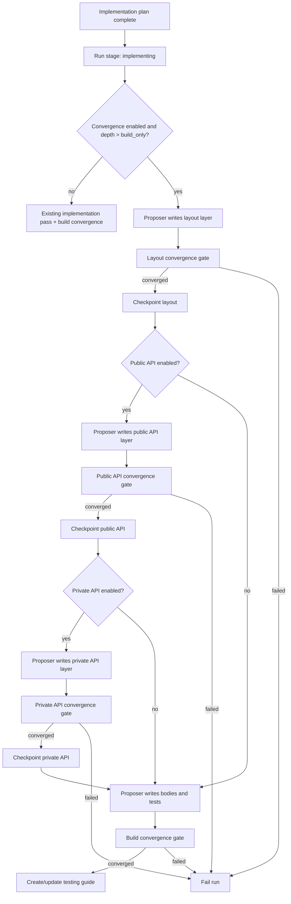

# Enhancement: Layered-diff convergence

## Parent feature

Primary parent feature:
- `feature-approval-to-implementation.md` — provides the implementation lifecycle, human testing guide, implementation approval path, and terminal run states.
Related specs that this enhancement extends or interlocks with:
- `enhancement-two-part-implementation-review.md` — adds initial and final implementation review checkpoints and review exchange records.
- `enhancement-bounded-convergence-review.md` — provides the bounded proposer/critic convergence loop, role-aware routing, `gate_exchanges`, same-model guard, and role/round/gate journal fields.
- `enhancement-append-only-backfill-journal.md` — provides durable `sessions.jsonl` and `feedback.jsonl` streams that this enhancement enriches by altitude.
- `enhancement-run-status-workspace-ai-context.md` — surfaces active model request metadata while implementation and review agents are running.
- `enhancement-model-provider-config.md` and `feature-openai-agent-sdk-runner.md` — provide provider-neutral AI profiles and route-based model selection.
GitHub issue: [#194 — Layered-diff convergence: altitude-staged implementer with layout/public/private/build review lenses](https://github.com/markdstafford/autocatalyst-v0/issues/194)
## What

Autocatalyst changes implementation from one large build pass into an optional descending-altitude build loop. When enabled, the implementation phase runs ordered altitude passes before the human sees a testing guide:
1. **Layout** — files, classes, modules, exported names as comments, and intent comments only.
2. **Public API** — exported signatures, public types, module boundary contracts, and expected error contracts.
3. **Private API** — internal helper signatures, responsibilities, docstrings, and internal seams.
4. **Build** — bodies, tests, docs updates, and the existing build-level bounded convergence review.
A proposer model fills only the current layer. A critic model reviews the current partial git diff for that altitude. If the critic finds blocker or warning issues that are in scope for that altitude, the proposer revises the current layer and the critic reviews again. The loop reuses the bounded convergence rules from issue 193: it converges when no blocker or warning findings remain, fails on max-round exhaustion, and fails on oscillation.
Every altitude reviews real source code through git diff context. Autocatalyst does not introduce design artifact files, manifest parsers, or new run stages. Intermediate code may not compile at the layout, public API, or private API altitudes; that is expected. The final build altitude must produce compiling, tested code according to the existing implementation contract.
The enhancement is config-gated under the existing implementation review convergence switch and remains off by default. With convergence disabled, behavior is unchanged. With convergence enabled and depth set to `build_only`, behavior matches the bounded build-level convergence model from issue 193.
## Why

The current bounded convergence loop catches implementation problems after the implementer has already produced a full diff. That is useful, but it catches the most expensive disagreements late. If the reviewer dislikes the file layout, public API shape, or helper boundaries after bodies and tests exist, the implementer must rewrite more code and may preserve accidental structure because it is already embedded in the diff.
Layered convergence moves those disagreements earlier. The critic can challenge wrong files, awkward exported contracts, or weak helper boundaries while the diff is still cheap to change. The implementer then builds bodies only after the higher-altitude structure has converged.
This keeps the experiment cheap to build because the artifact under review is always a git diff. The same coordinator, reviewer context, exchange persistence, role routing, and journal fields can be reused with altitude-specific prompts and context selection.
## User stories

- As Enzo, I can enable full layered convergence for feature work so layout, public API, private API, and build decisions each receive critic review before the next layer is written.
- As Enzo, I can run build-only convergence for chores and get behavior identical to issue 193.
- As Enzo, I can see a run fail when an early altitude does not converge instead of watching later code pile onto a bad structure.
- As Enzo, I can inspect the testing guide and journal records to see which altitude produced findings, how many rounds it took, and why a gate failed if it did.
- As Phoebe, I can read the testing guide and understand that the implementation passed staged AI review without reading raw model transcripts.
- As an operator, I can choose a depth ladder per repository or run so expensive early gates are used only when they are worth the cost.
- As an operator, I can set a hard per-run model-session budget so layered convergence cannot fan out indefinitely across feedback passes.
- As Enzo, I can have small human feedback default to build-only reconvergence instead of paying for the full altitude ladder again.
- As an operator, I can trust ordinary runs because the feature is off by default and build-only mode preserves current convergence behavior.
- As an analytics agent, I can compare findings, rounds, cost, and latency by altitude using `sessions.jsonl`, `feedback.jsonl`, and `gate_exchanges`.
## Design changes

This is a backend workflow enhancement. It adds no new primary UI. Existing testing-guide and progress-message surfaces gain altitude-specific review history when layered convergence is enabled.
### Goals

- Split implementation into ordered altitude passes: `layout`, `public_api`, `private_api`, and `build`.
- Ensure each enabled altitude converges through the issue 193 bounded loop or fails the run before the next altitude starts.
- Keep all altitude review context as real git diffs; do not introduce separate design artifacts or parsers.
- Feed critics the correct partial diff for the current altitude through a `getContext(gate)` strategy.
- Use altitude-specific proposer, critic, and revise prompts for every enabled altitude.
- Mechanically prevent early-altitude critics from filing missing-body or missing-implementation findings.
- Mechanically reject early-altitude proposer diffs that add lower-altitude bodies or tests before the build gate.
- Enforce a global model-session ceiling across initial implementation, layered gates, and implementation feedback passes.
- Verify that the build altitude preserves converged layout/public/private contracts unless an upper gate is explicitly re-run.
- Checkpoint each converged altitude before starting the next altitude.
- Add a depth ladder so cost can be tuned from build-only to full layered convergence.
- Persist gate history and journal sessions with altitude gate names.
- Add per-altitude telemetry with gate ID, round, finding counts, elapsed time, profile IDs, and outcome.
- Preserve all existing behavior when convergence is disabled.
### Non-goals

- Replacing the issue 193 convergence engine, role routing, same-model guard, oscillation guard, or exchange persistence.
- Adding new `RunStage` values or human approval points between altitudes.
- Adding multi-critic fan-out, voting, or consensus protocols.
- Adding first-class design artifacts, schemas, or parsers for layout or API plans.
- Guaranteeing layout/API critics have compiler or test signal. Early gates review by reading because intermediate code may not compile.
- Changing final post-human-approval PR review beyond preserving the existing build-level bounded review.
- Guaranteeing provider-level read-only critic isolation. Autocatalyst can enforce prompts, routing, and branch guards; provider sandbox behavior remains runner-specific.
### Personas and narratives

- **Enzo: Engineer/operator** — wants expensive structural disagreement to happen before bodies and tests are written.
- **Phoebe: Product manager** — wants a simple testing guide that says staged AI review happened and whether it converged.
- **Autocatalyst operator** — chooses the depth ladder and model profiles for cost, speed, and quality.
- **Analytics agent** — reads per-altitude journals to decide whether each gate earns its cost.
A full feature run starts after spec approval and implementation planning. Autocatalyst asks the proposer to create only a layout: new files, module/class declarations if useful, and intent comments. The layout critic flags that a new helper file duplicates an existing service boundary. The proposer moves the skeleton into the existing module, and the critic converges. Only then does Autocatalyst ask for public signatures.
At the public API altitude, the critic challenges an exported function because it returns `boolean` where callers need an error reason. The proposer changes the signature to return a discriminated result type. The critic converges before any body exists, so the later build altitude can implement the better contract directly.
For a small chore, the operator sets depth to `build_only`. Autocatalyst skips layout and API altitudes and runs the issue 193 build-level convergence loop exactly as before. The cost stays low, and existing run behavior remains predictable.
### Altitude contracts

Each altitude has a strict output contract. The proposer must fill only the current layer and must not sneak lower-altitude work into earlier passes.

Altitude
Proposer may add
Proposer must not add
Critic focus
Allowed finding categories

`layout`
Skeleton files, modules, classes, exported-name comments, high-level intent comments, `TODO(gate-layout)` markers
Function signatures, type definitions with meaningful fields, bodies, tests
File placement, naming, reuse of existing modules, missing call sites, needless new files
`maintainability`, `docs`

`public_api`
Exported signatures, public types, public constants, module boundary error contracts, public doc comments, `TODO(gate-public_api)` markers
Private helper signatures, bodies, tests
Exported names, parameter shape, return shape, public error contracts, boundary ownership
`maintainability`, `docs`, `security`

`private_api`
Internal helper signatures, internal types, docstrings, responsibility comments, `TODO(gate-private_api)` markers
Bodies and tests except tiny placeholder throws when required by TypeScript syntax
Helper seams, duplicated helpers, dead helpers, responsibility split, private error flow
`maintainability`, `docs`, `security`

`build`
Bodies, tests, docs updates, config updates, final cleanup
Unreviewed large structural pivots unless required to satisfy build findings
Correctness, tests, security, maintainability, docs, PR readiness where applicable
Existing issue 193 build/final category set

Early-altitude critic prompts must state this contract directly:
```plain text
You are reviewing a -only diff. Signatures and/or bodies may be intentionally absent and out of scope. TODO(gate-*) markers are expected and correct at this altitude. Do not file missing-body, missing-test, or missing-implementation findings for work that belongs to a lower altitude.
```
The prompt is not the only guard. The coordinator filters findings by each altitude's category allowlist and by normalized finding scope before deciding whether the gate blocks. Early-altitude critic verdicts must include backward-compatible metadata on each finding:
```typescript
type LayeredFindingScope = 'current_altitude' | 'lower_altitude' | 'prior_context';
type LayeredFindingReasonCode =
  | 'altitude_contract_violation'
  | 'layout_boundary'
  | 'public_api_contract'
  | 'private_api_contract'
  | 'security_contract'
  | 'documentation_gap'
  | 'missing_lower_altitude_body'
  | 'missing_lower_altitude_test'
  | 'missing_lower_altitude_implementation'
  | 'build_signal_unavailable_until_build';
```
The existing `ImplementationReviewResult` and finding category enum remain closed. The new `scope` and `reason_code` fields are optional for backward compatibility on stored results. Altitude critic prompts must require them for new layered verdicts, but parser/coordinator handling is fail-open for early gates: a finding with missing or invalid `scope` or `reason_code` is downgraded to a recorded non-blocking note with filter reason `invalid_layered_metadata`. The coordinator must not infer these fields from free text and must not fail the whole critic verdict solely because optional layered metadata is absent. Other structured-output errors that make the verdict unreadable still use the existing structured-output recovery path.
Filtering order is deterministic:
1. Findings with `severity: "info"` never block.
2. At `layout`, `public_api`, or `private_api`, findings with missing or invalid `scope` or `reason_code` are recorded as non-blocking notes with filter reason `invalid_layered_metadata`. They do not block, even when their category is otherwise allowed.
3. At `layout`, `public_api`, or `private_api`, findings with `scope: "lower_altitude"` or reason code `missing_lower_altitude_body`, `missing_lower_altitude_test`, `missing_lower_altitude_implementation`, or `build_signal_unavailable_until_build` are recorded as out-of-scope notes and must not block, even when the category is otherwise allowed such as `maintainability`.
4. Findings whose category is not allowed for the current altitude are recorded as out-of-scope notes and must not block.
5. Remaining blocker or warning findings block convergence.
A critic result with invalid layered metadata, disallowed categories, or out-of-scope lower-altitude reason codes is recorded for diagnostics but does not block the gate. If all findings are filtered or info-only, the gate converges with notes. This keeps early gates from failing because bodies or tests are absent, even if a critic labels that request as an allowed category such as `maintainability`, and keeps gate success from depending on a critic model always emitting novel metadata correctly.
### Required altitude contract validation

Prompts and critic review are not sufficient to preserve altitude separation. The coordinator must run a required mechanical validator after every `layout`, `public_api`, and `private_api` proposer pass and after every proposer revision in those gates, before calling the critic and before creating a checkpoint. The validator operates on the changed regions in the cumulative diff for supported TypeScript/JavaScript source files.
Rules:
- `layout` diffs are rejected when changed regions add non-comment function or method bodies, meaningful type/interface fields, executable statements, test files, or assertions. Empty declarations, comments, and `TODO(gate-layout)` markers are allowed.
- `public_api` diffs are rejected when changed regions add private helper signatures, executable bodies, tests, or assertions. Exported signatures, public types, public constants, public doc comments, and `TODO(gate-public_api)` markers are allowed.
- `private_api` diffs are rejected when changed regions add executable bodies, tests, or assertions beyond tiny syntax placeholders such as a single `throw new Error("TODO(gate-private_api)")` needed to keep TypeScript syntax representable.
- Validation failures are represented as synthetic in-scope findings with reason code `altitude_contract_violation`. If a revision round remains and the global session budget allows it, the proposer is asked to revise. If the violation persists or no revision budget remains, the gate fails before any lower altitude starts.
- The required v0 validator must cover TypeScript and JavaScript files because this repository is TypeScript. Unsupported changed file types must be logged as unsupported validation coverage and still reviewed by prompts/critics, but they do not satisfy the TypeScript/JavaScript mechanical acceptance criteria.
### Build contract preservation

The accepted upper altitudes become contracts for the build proposer. Before the build gate can converge, Autocatalyst must compare the build result against the most recent accepted upper-altitude checkpoints and verify that reviewed structure remains intact.
Rules:
- The check compares exported names, exported signatures, public type shapes, module/file layout, and private helper signatures when a corresponding upper altitude was enabled.
- The build proposer may fill bodies, tests, docs, and final cleanup, but must not silently change a converged public API, move reviewed layout boundaries, or reshape private seams.
- If the build pass discovers that an upper contract must change to satisfy correctness, Autocatalyst must either rerun the affected upper altitude and downstream altitudes within the remaining model-session budget or fail with a clear contract-drift error. It must not let the build gate pass with unreviewed upper-altitude drift.
- The build critic prompt must include the accepted upper-altitude summaries/checkpoint references and explicitly ask the critic to flag unapproved contract drift.
V0 comparison mechanics are intentionally narrow and deterministic:
- Supported languages are TypeScript and JavaScript source files: `.ts`, `.tsx`, `.js`, `.jsx`, `.mts`, `.cts`, `.mjs`, and `.cjs`. Declaration files are compared as public API text after normalization. Unsupported file types are included in module/file layout comparisons by path only and are logged as unsupported symbol extraction coverage.
- Extraction must use the TypeScript compiler API or an existing structured AST helper, not regex-only parsing, for supported files.
- Module/file layout is the sorted set of changed source paths accepted at each enabled upper altitude, normalized to POSIX separators and repository-relative paths. Adding tests or docs during build is allowed. Moving, deleting, or renaming an upper-altitude source path is drift unless the affected upper altitude is rerun.
- Exported names are the sorted set of explicit exported declarations and re-exports per module. Default exports normalize to the name `default`; anonymous default declarations include their syntactic kind.
- Exported signatures include exported functions, methods on exported classes/interfaces, constructors on exported classes, exported variables/constants, exported enums, and exported type/interface aliases. Signatures are compared after formatting-insensitive normalization: comments, whitespace, semicolons, quote style, parameter names on function types where TypeScript treats them as non-semantic, and body text are ignored. Parameter count/order, optional/rest markers, type annotations, generic parameter names/count/constraints/defaults, overload sets, return types, readonly/static/async/export modifiers, enum member names/values, and thrown/returned public error-contract comments marked by the public API prompt are significant.
- Public type shapes include exported interface/type/class public fields and methods, public enum members, discriminated-union members, literal property names, optional/readonly markers, and public constant literal types. Adding, removing, renaming, or changing these shapes is drift.
- Private helper signatures include non-exported top-level functions/classes/types and private or unexported class methods added by the private API altitude. Bodies and comments are ignored; helper name, containing path/class, parameter count/order/types, generic constraints, return type, visibility, and async/static modifiers are significant.
- Rename handling is v0 conservative: a path or symbol rename is reported as delete+add drift unless the affected upper altitude is explicitly rerun. No fuzzy rename matching is required.
- Allowed final cleanup includes filling or replacing placeholder bodies, removing `TODO(gate-*)` comments, formatting, adding imports required by bodies without changing exported surfaces, adding tests, adding docs, and updating config needed by the build. Cleanup must not alter extracted upper-altitude symbols or source path layout.
- Example pass: the build altitude replaces `throw new Error("TODO(gate-private_api)")` with real logic inside an already-reviewed helper and adds tests, while exported signatures and helper signatures remain unchanged.
- Example fail: the build altitude changes `export function parseConfig(input: string): Result` to return `boolean`, moves `src/core/config.ts` to `src/config/index.ts`, or adds a new unreviewed private helper that changes the reviewed helper seam without rerunning the private API altitude.
### Depth ladder and config

Extend the existing convergence config:
```yaml
implementation_review:
  convergence:
    enabled: false
    allow_same_model: false
    depth: build_only # build_only | layout | public_api | full
    feedback_depth: build_only # build_only | layout | public_api | full | inherit
    max_model_sessions_per_run: 24
```
Rules:
- Missing `implementation_review.convergence.enabled` means `false`.
- Missing `implementation_review.convergence.depth` means `build_only`.
- Missing `implementation_review.convergence.feedback_depth` means `build_only`. `inherit` means implementation feedback uses the initial `depth` value.
- Missing `implementation_review.convergence.max_model_sessions_per_run` means `24`. Values must be positive integers.
- `enabled: false` disables all convergence behavior and preserves current single-pass review behavior.
- `enabled: true` with `depth: build_only` runs only the issue 193 build convergence gate.
- `depth: layout` enables `layout` then `build`.
- `depth: public_api` enables `layout`, `public_api`, then `build`.
- `depth: full` enables `layout`, `public_api`, `private_api`, then `build`.
- The altitude list is always ordered by descending altitude. Operators cannot reorder gates.
- Invalid depth values fail config validation with a clear error.
- Max-round config from issue 193 applies to each enabled altitude unless a later implementation adds explicit per-altitude budgets. The recommended default remains 2 critic rounds when convergence is enabled.
- The global `max_model_sessions_per_run` budget is enforced across the whole run, including the initial implementation, all altitude proposer/critic/revise calls, final review calls, and all implementation feedback passes. Before starting a model session, the coordinator reserves one budget slot. If no slot remains, the run fails safely with a clear budget-exhausted error before making another provider call.
- Feedback passes use `feedback_depth`, not `depth`, by default. This makes small human feedback build-only unless the operator explicitly opts back into full layered reconvergence with `feedback_depth: inherit` or another layered value.
Budget accounting must be durable per run, not per handler invocation. The implementation must use one of these equivalent mechanisms:
- Preferred: append a `model_session_reserved` journal entry with a stable `session_id`, run ID, gate, role, round, pass kind, and reservation sequence before each provider call; append a matching completion/failure session record when the call finishes. On process restart or later human feedback, reconstruct consumed budget by counting unique reservation `session_id` values for the run.
- Acceptable: maintain a run-level persisted counter that is updated atomically before every provider call and can be read by all implementation, feedback, and final-review handlers.
Rules:
- The reservation is the unit counted against the limit, even if the provider call later fails, because it consumed or attempted to consume a model session.
- `session_id` must be stable and unique for the reserved call so retrying journal writes or re-reading journals does not double-count.
- If a reservation was written but no completion record exists after a crash, the reserved slot still counts. This fail-safe behavior prevents restarts from exceeding the run-wide ceiling.
- Existing `sessions.jsonl` entries may satisfy the reconstruction requirement only if they are written before provider calls and contain stable unique IDs; otherwise the implementation must add the reservation event or persisted counter.
This ladder lets a chore run build-only, a moderate backend change run layout plus build, and a feature run the full set. The session ceiling prevents repeated feedback rounds from expanding into unbounded model calls.
### Lifecycle placement

Layering happens inside the existing implementation phase. It does not add run stages.

The implementation start handler uses `depth` when convergence is enabled. The implementation feedback handler uses `feedback_depth` when convergence is enabled, defaulting to build-only feedback reconvergence. Final review after human approval remains the existing build-level final review because there is no new staged build at PR time.
Implementation feedback passes start from a branch that may already contain a complete prior implementation with bodies and tests. For feedback passes, Autocatalyst creates a new feedback base checkpoint at the current run-branch state before the feedback proposer writes any changes. Layered altitude contracts apply only to the incremental feedback-pass diff from that feedback base, not to complete bodies and tests that already existed in the base. Existing lower-altitude code may appear as unchanged context and is not a violation. During `layout`, `public_api`, and `private_api` feedback passes, the proposer may adjust the relevant structure or signatures needed for the human feedback but must not add or rewrite lower-altitude bodies or tests in the incremental diff except syntax placeholders allowed by the altitude contract. The `build` feedback gate then implements bodies, tests, and final cleanup for the cumulative feedback-pass diff.
### Checkpoints and branch guard

After an altitude converges, Autocatalyst creates a local checkpoint before starting the next altitude. The preferred checkpoint strategy is an internal local git reference under a namespace such as `refs/autocatalyst/runs//` that points at a snapshot commit created from the current index and working tree, similar to `git stash create` plus `git update-ref`. This avoids adding non-compiling intermediate commits to the run branch and bypasses repository commit hooks because no branch commit is created. A branch commit checkpoint is allowed only as an explicit fallback when internal snapshot refs are unavailable or intentionally disabled by repository configuration, and that fallback must be visible in telemetry.
Rules:
- Checkpoints are local to the existing run repository and must not switch the checked-out run branch. Internal checkpoint refs are preferred over commits on the run branch.
- Autocatalyst does not create, switch, push, merge, or open branches as part of this enhancement.
- Checkpoint messages should include the run ID and altitude, such as `autocatalyst: layout checkpoint for `.
- The branch guard runs after each proposer pass and before each checkpoint.
- Early checkpoint commits may not compile. Build and test commands must not run until the build altitude unless a later implementation adds syntax-only checks that tolerate placeholders.
- If checkpoint creation fails, the run fails before the next altitude starts because the next `getContext(gate)` could otherwise review the wrong diff.
- Checkpoints must include staged and unstaged run changes exactly as the critic reviewed them. Creating a checkpoint must not clean, reset, restage, or otherwise rewrite the working tree or index except for the temporary plumbing needed to create the snapshot.
- Checkpoints must include newly-created untracked files that are not ignored by git. Ignored files remain excluded unless they are already tracked. The preferred implementation is a temporary index populated with the tracked index, tracked working-tree content, and non-ignored untracked paths discovered with `git ls-files --others --exclude-standard`; the temporary index is then written to a tree and committed under the internal checkpoint ref. This temporary plumbing must not mutate the user's real index or leave untracked files staged after checkpointing.
- Pre-existing dirty state at the start of an implementation or feedback pass is part of that pass's base only after the branch guard accepts it and the base checkpoint is captured. If the branch guard rejects the state, the run fails before any altitude work starts.
- Internal checkpoint refs must be excluded from PR history by construction. If the fallback branch-commit strategy is used, the implementation must either squash/remove intermediate checkpoint commits before PR creation through the existing Autocatalyst PR preparation path or fail with a clear error if the repository policy does not allow such cleanup. Non-compiling checkpoint commits must never be pushed as the final PR history.
- Branch-commit fallback honors repository commit hooks by default. If an existing Autocatalyst git helper has an explicit, configured `--no-verify` policy, that policy must be logged with the checkpoint strategy; hook or commit failure fails the run before the next altitude.
### Diff context strategy

Replace the hardcoded full git diff in implementation review with a gate-aware context strategy:
```typescript
export interface ConvergenceGateContext {
  gate: 'layout' | 'public_api' | 'private_api' | 'build' | string;
  base_ref: string;
  checkpoint_ref?: string;
  working_directory: string;
}

type GetGateContext = (context: ConvergenceGateContext) => Promise;
```
This spec chooses **cumulative diff to the current altitude** rather than incremental-only diff. The critic sees all current source decisions from the original base through the current altitude. This costs more tokens than reviewing only the latest layer, but it gives the critic enough context to judge whether public API choices match the layout and whether private seams match public contracts.
Rules:
- For an initial implementation pass, `base_ref` is the pre-implementation run-branch base captured before the layout/build proposer starts.
- For an implementation feedback pass, `base_ref` is the feedback base checkpoint captured from the current run-branch state before feedback changes begin. This means prior full implementation bodies and tests are baseline context, not lower-altitude violations.
- Context must include non-ignored untracked files created by the proposer, not only files visible to `git diff  --`. Untracked file content is rendered as new-file diff hunks using `--no-index`-equivalent formatting or a structured git helper that produces the same patch semantics, and those paths are included in `changed_files`.
- `layout` context is base-to-layout for the current pass.
- `public_api` context is base-to-public-api for the current pass, including the accepted layout changes from that pass.
- `private_api` context is base-to-private-api for the current pass, including accepted layout and public API changes from that pass.
- `build` context is base-to-current working tree for the current pass, including bodies and tests added or changed in that pass.
- `getContext(gate)` runs inside each critic round, not once before the loop, so re-reviews see proposer revisions from prior rounds.
- The context builder must redact secrets using the same redaction path used by existing prompts and journal capture.
### Reusable gate shape

Factor the convergence coordinator around a reusable gate shape:
```typescript
export interface ConvergenceGate {
  gate: 'layout' | 'public_api' | 'private_api' | 'build' | string;
  enabled: boolean;
  proposerRoute: AgentRoute;
  criticRoute: AgentRoute;
  allowedFindingCategories: ImplementationReviewFindingCategory[];
  buildProposePrompt(input: GatePromptInput): string;
  buildCritiquePrompt(input: GatePromptInput): string;
  buildRevisePrompt(input: GateRevisionPromptInput): string;
  parseArtifact?(content: string): TArtifact;
  parseVerdict(content: string): TVerdict;
  maxRounds: number;
  getContext: GetGateContext;
}
```
For layered implementation modes with depth greater than `build_only`, the current issue 193 initial implementation review behavior becomes the altitude `build` gate. The upper altitudes use the same bounded loop with different prompts, allowed categories, and `getContext` labels. The implementation does not need generic type parameters if that adds complexity, but the code should preserve these separations: route, prompt, parse, category allowlist, max rounds, and context.
Build-only mode is the compatibility path and preserves issue 193 gate names and semantics. With convergence enabled and `depth: build_only`, the initial implementation review persists `gate: "initial"` and the final post-human-approval review persists `gate: "final"` in `gate_exchanges`, exactly as issue 193 specifies. Implementations may add additive metadata such as `altitude: "build"` or `lens: "build"` to those records, but existing readers must continue to work from `initial`/`final`. In layered modes, pre-human-handoff implementation altitude records use `layout`, `public_api`, `private_api`, and `build`; the post-human-approval final review still uses `final` because it is not a layered construction pass.
### Proposer prompts by altitude

Each proposer pass receives the approved spec, implementation plan, prior altitude checkpoint summaries, and current gate contract.
The prompt must require:
- Only current-altitude work.
- No lower-altitude bodies or tests before the build gate.
- `TODO(gate-)` placeholders where needed to keep the tree readable.
- A short altitude summary in the implementation result.
- Structured review responses when revising after critic findings.
If the proposer violates the altitude contract, the critic may file an in-scope maintainability finding, but the critic is not the primary enforcement mechanism. The coordinator must run the required mechanical altitude contract validation described above after every early-altitude proposer pass and revision. A validation failure rejects the layer before checkpointing; if revision budget remains, the proposer receives a structured synthetic `altitude_contract_violation` finding, otherwise the gate fails before any lower altitude starts.
### Critic prompts by altitude

Each critic prompt receives:
- The approved spec path.
- The implementation plan path when available.
- The current altitude name and contract.
- The cumulative git diff for the current altitude.
- Changed files.
- Prior gate summaries if available.
- The allowed finding categories and out-of-scope finding rules.
The critic must return the existing `ImplementationReviewResult` JSON shape, augmented for layered early gates with the `scope` and `reason_code` metadata described in Finding filtering. It should keep stable finding IDs within a gate when a finding repeats across rounds. Findings that omit or garble only layered metadata are preserved as non-blocking notes rather than causing a verdict parse failure.
Early critics must not request tests, working bodies, or complete implementations. The build critic uses the issue 193 lens and may file correctness, test, security, maintainability, docs, and PR-readiness findings according to the existing initial/final review rules. Build critic prompts must also state that the build proposer is expected to preserve converged layout, public API, and private API contracts from prior altitude checkpoints; unapproved signature, exported-type, module-boundary, or large layout drift is an in-scope build finding.
### Finding filtering

Because `ImplementationReviewFindingCategory` is intentionally closed, altitude-specific focus is expressed through prompts, category allowlists, and backward-compatible `scope`/`reason_code` finding metadata rather than new category enum values.
Rules:
- The parser continues to accept only the current closed category set.
- Layered early-gate prompts require `scope` and `reason_code` on each finding, but parsing fails open for those metadata fields: missing or invalid metadata downgrades only that finding to a non-blocking recorded note with filter reason `invalid_layered_metadata`.
- Each gate defines allowed categories.
- For `layout`, `public_api`, and `private_api`, findings with invalid layered metadata and any finding scoped to `lower_altitude` or carrying a lower-altitude missing-body/test/implementation reason code are filtered before category allowlists are evaluated.
- Disallowed blocker or warning findings are downgraded to recorded notes for that gate and must not block convergence.
- The coordinator logs `implementation.review.finding_filtered` with run ID, gate, round, finding ID, original severity, category, scope, reason code, and filter reason.
- Tests must prove that a body-less `layout`, `public_api`, or `private_api` diff does not fail because the critic asks for implementation bodies or tests, including when that finding uses an otherwise-allowed category such as `maintainability` or omits the new layered metadata.
### Persistence and testing-guide display

Reuse `run.gate_exchanges` from issue 193. For layered implementation gates:
- `gate` is one of `layout`, `public_api`, `private_api`, or `build`.
- `round` is the critic round within that altitude.
- `proposer_profile` and `critic_profile` are recorded for every gate.
- `review_status`, `findings`, `responses`, `converged`, `non_convergence_reason`, and `requires_human_retest` use the existing gate exchange meanings.
Layered metadata and filtered findings are persisted additively so existing readers can ignore unknown fields:
```typescript
type LayeredFindingDisposition =
  | 'blocking'
  | 'info'
  | 'filtered_note';

type LayeredFindingFilterReason =
  | 'invalid_layered_metadata'
  | 'lower_altitude_scope'
  | 'lower_altitude_reason_code'
  | 'category_not_allowed';

interface StoredLayeredFindingMetadata {
  scope?: LayeredFindingScope;
  reason_code?: LayeredFindingReasonCode;
  disposition: LayeredFindingDisposition;
  filter_reason?: LayeredFindingFilterReason;
  original_severity: ImplementationReviewFindingSeverity;
  original_category: ImplementationReviewFindingCategory;
}
```
Storage rules:
- `gate_exchanges[].findings[]` keeps every critic finding that parsed, including filtered early-altitude notes. The original `severity` and `category` fields are preserved exactly as the critic emitted them.
- Each stored layered finding adds a `layered` object matching `StoredLayeredFindingMetadata`. For non-layered or legacy gates this object may be absent.
- In-scope blocker/warning findings store `layered.disposition: "blocking"` and have no `filter_reason`.
- Info findings store `layered.disposition: "info"` and have no `filter_reason`; they never block.
- Filtered early-altitude findings store `layered.disposition: "filtered_note"` and a required `filter_reason`. The coordinator must not rewrite their severity to `info`, because readers need to see the original model claim and the reason Autocatalyst made it non-blocking.
- Existing exchange-level convergence decisions count only findings with `layered.disposition: "blocking"` or legacy blocker/warning findings from gates that do not use layered filtering. Readers distinguish blocking findings from notes through `layered.disposition`; if absent, they fall back to the existing severity/category rules.
- If a critic finding cannot be parsed into the existing finding shape at all, the existing structured-output recovery path applies and no partial layered finding is stored.
Compatibility rules:
- Disabled convergence keeps the legacy issue 193/two-part review persistence behavior.
- Build-only convergence preserves issue 193 `gate: "initial"` before human handoff and `gate: "final"` before PR creation. It may add optional build-lens metadata but must not require readers to understand `gate: "build"` for build-only runs.
- Layered convergence uses altitude gate names only for the staged implementation construction before human handoff. Final post-human-approval review remains `gate: "final"`.
- Existing stored runs that use only `initial`/`final`, only altitude gate names, or no `gate_exchanges` must render without migration.
Testing guides group AI review history by altitude:
```markdown
## AI review

### Layered implementation review

Depth: `full`
Convergence: converged

#### Layout — converged in 2 rounds

- [x] [LAYOUT-1] New file duplicates the existing review coordinator boundary.
  Fixed — moved the skeleton into `implementation-review-coordinator.ts`.

#### Public API — converged in 1 round

- No blocker or warning findings.

#### Private API — converged in 1 round

- No blocker or warning findings.

#### Build — converged in 2 rounds

- [x] [BUILD-1] Missing regression test for depth fallback.
  Fixed — added config resolver coverage.
```
Rules:
- Hide raw prompts, raw model transcripts, secrets, and chain-of-thought.
- Make it clear when early altitudes did not compile by design.
- Render filtered early-altitude findings under a non-blocking "Notes filtered by altitude" subsection when useful for diagnostics. Include finding ID, original severity/category, scope, reason code, and filter reason, and do not display them as open testing obligations.
- Show non-converged altitude, reason, and open blocker or warning findings when the run fails before human handoff.
- Preserve legacy AI review rendering when `gate_exchanges` is absent.
### Journal interlock

`sessions.jsonl` records:
- Model-session budget reservations write a durable unique `session_id`, run ID, `role`, `round`, `gate`, pass kind, reservation sequence, and `budget_limit` before each proposer, critic, revise, or final-review provider call when `sessions.jsonl` is used as the budget reconstruction source.
- Proposer sessions write `role: "proposer"`, `round`, and `gate: `.
- Critic sessions write `role: "critic"`, `round`, and `gate: `.
- Build-only mode keeps the issue 193 initial/final gate behavior, with optional additive build-lens metadata only.
`feedback.jsonl` records:
- Critic findings from `gate_exchanges` write `target: "implementation"` and `gate: `.
- `author_principal` identifies the critic profile.
- Disallowed or otherwise filtered early-altitude findings that are mirrored to `feedback.jsonl` use `disposition: "not_applicable"` when that disposition exists; otherwise they use `disposition: "addressed"` with additive fields `note_kind: "filtered_layered_finding"`, `filter_reason`, `scope`, `reason_code`, `original_severity`, and `original_category`. They must not become open blocking feedback.
- Open non-converged blocker or warning findings remain `disposition: "open"`.
- Fixed findings become `addressed`; declined findings become `wont_fix`; info-only converged notes become `addressed`.
### Progress updates

Post best-effort progress updates through the existing progress callback:
```plain text
Layered implementation enabled — depth full
Layout pass started with grove-sonnet-4.6-medium
Layout review round 1 returned 1 finding — asking proposer to revise
Layout converged after 2 rounds — checkpointing layer
Public API pass started with grove-sonnet-4.6-medium
Build converged after 2 rounds — creating testing guide
```
Progress send failures must not fail the run. They log `progress_failed` with run ID, gate, round when known, and phase.
### Telemetry

Add structured logs following `context-agent/standards/logging.md`:
- `implementation.layered.started` — run ID, request ID, depth, feedback depth, enabled altitudes, model-session budget, model sessions already used.
- `implementation.layer.started` — run ID, gate, proposer profile, checkpoint base.
- `implementation.layer.completed` — run ID, gate, elapsed ms, changed file count.
- `implementation.layer.checkpoint_started` — run ID, gate, branch, checkpoint strategy.
- `implementation.layer.checkpoint_completed` — run ID, gate, checkpoint ref, elapsed ms.
- `implementation.layer.checkpoint_failed` — run ID, gate, error.
- `implementation.review.context_built` — run ID, gate, round, context kind, changed file count, diff byte count.
- `implementation.review.budget_reserved` — run ID, gate, role, round, model sessions used, model-session budget.
- `implementation.review.budget_exhausted` — run ID, gate when known, role when known, model sessions used, model-session budget.
- `implementation.layer.contract_validation_failed` — run ID, gate, round, file count, violation count, validation mode.
- `implementation.build.contract_drift_detected` — run ID, gate, drift kind, file count, symbol count when available.
- `implementation.review.finding_filtered` — run ID, gate, round, finding ID, category, reason.
- `implementation.review.converged` and `implementation.review.non_converged` — include gate, rounds used, finding counts, and elapsed ms.
Logs must not contain raw prompts, raw diffs, secrets, tokens, or credential values.
### Risks and mitigations

- **Risk: Cost and latency increase sharply.** Mitigation: keep the feature off by default, support build-only mode, default feedback passes to `build_only`, enforce `max_model_sessions_per_run`, preserve max-round bounds, and log per-altitude cost and elapsed time through journal session records.
- **Risk: Early code does not compile.** Mitigation: do not run typecheck/test until the build altitude; document that early gates review by reading only.
- **Risk: The proposer writes bodies too early.** Mitigation: use strict prompts, expected `TODO(gate-*)` markers, required mechanical TypeScript/JavaScript altitude contract validation, synthetic revision findings, and fail before the next altitude if the layer remains invalid.
- **Risk: Critics file missing-implementation findings anyway.** Mitigation: use explicit prompt contracts, requested scope/reason-code metadata, fail-open metadata filtering, mechanical lower-altitude filtering before category filtering, and tests with body-less diffs in otherwise-allowed categories.
- **Risk: The build layer silently changes converged upper-altitude contracts.** Mitigation: snapshot upper-altitude checkpoints, run a build-contract preservation check before build convergence can pass, instruct the build critic to flag drift, and require tests for public signature/layout preservation.
- **Risk: Cumulative diffs become too large.** Mitigation: start with cumulative diffs for correctness, record token/latency data, and leave incremental or summarized contexts as a later optimization.
- **Risk: Agreement theater.** Mitigation: persist findings and rounds by altitude so later analysis can measure whether early gates reduce build-level findings or merely add cost.
- **Risk: Intermediate checkpoint commits are non-compiling.** Mitigation: prefer internal checkpoint refs that do not enter PR history; keep branch-commit fallback explicit and config-gated; document that only final build must pass compilation/tests.
## Technical changes

### Affected files

- `src/types/config.ts` — add `implementation_review.convergence.depth`, `feedback_depth`, and `max_model_sessions_per_run` types and validation.
- `src/core/config.ts` — resolve depth, feedback-depth, and session-budget defaults and derive the ordered enabled altitude list.
- `src/core/ai/implementation-review-coordinator.ts` — factor convergence into reusable gate execution, add altitude gates, context strategy, fail-open metadata filtering, required altitude contract validation, build contract preservation, global session-budget checks, and altitude exchange persistence.
- `src/core/ai/agent-services.ts` — add altitude-specific proposer, critic, and revise prompt builders or extend existing builders with altitude contracts.
- `src/types/ai.ts` — add altitude gate type aliases if useful; preserve the closed finding category set unless implementation chooses a backward-compatible metadata field.
- `src/core/handlers/implementation-start-handler.ts` — run layered implementation before testing-guide creation when enabled.
- `src/core/handlers/implementation-feedback-handler.ts` — run layered implementation for implementation feedback passes when enabled.
- `src/core/handlers/implementation-approval-handler.ts` — preserve existing final build-level review behavior and ensure layered gate history renders before PR flow when present.
- `src/core/git-branch-guard.ts` or a new nearby helper — support checkpoint creation/verification if no existing git helper fits.
- `src/types/impl-feedback-page.ts` — ensure update input can render altitude `gate_exchanges`.
- `src/adapters/notion/implementation-feedback-page.ts` — render altitude-grouped gate history.
- `src/core/journal/run-journal.ts` and `src/types/journal.ts` — ensure altitude gate values are captured and feedback dispositions handle filtered findings.
- `tests/core/config.test.ts` — cover depth validation and defaults.
- `tests/core/ai/implementation-review-coordinator.test.ts` — cover altitude ordering, context strategy, fail-open metadata/category filtering, required contract validation, build contract preservation, session-budget exhaustion, convergence, non-convergence, and build-only compatibility.
- `tests/core/handlers/implementation-start-handler.test.ts` and `implementation-feedback-handler.test.ts` — cover layered flow placement and failure behavior.
- `tests/core/handlers/implementation-approval-handler.test.ts` — cover final review compatibility.
- `tests/adapters/notion/implementation-feedback-page.test.ts` — cover altitude rendering.
- `tests/core/journal/run-journal-facade.test.ts` — cover altitude gate sessions and findings.
### Config resolver

Add a depth union:
```typescript
export type ImplementationReviewConvergenceDepth =
  | 'build_only'
  | 'layout'
  | 'public_api'
  | 'full';

export interface ImplementationReviewConvergencePolicy {
  enabled: boolean;
  allow_same_model: boolean;
  depth: ImplementationReviewConvergenceDepth;
  feedback_depth: ImplementationReviewConvergenceDepth | 'inherit';
  max_model_sessions_per_run: number;
}
```
Derived altitude lists:
```typescript
const ALTITUDES_BY_DEPTH = {
  build_only: ['build'],
  layout: ['layout', 'build'],
  public_api: ['layout', 'public_api', 'build'],
  full: ['layout', 'public_api', 'private_api', 'build'],
} as const;
```
Validation rules:
- `depth` must be one of the supported values when present.
- Missing depth resolves to `build_only`.
- Missing feedback depth resolves to `build_only`; `inherit` resolves to the initial implementation depth for feedback passes.
- Missing max model sessions resolves to `24`; invalid or non-positive values fail validation.
- Missing convergence config resolves to `{ enabled: false, allow_same_model: false, depth: 'build_only', feedback_depth: 'build_only', max_model_sessions_per_run: 24 }`.
- Existing convergence max-round defaults from issue 193 remain unchanged within the global session ceiling.
### Coordinator algorithm

Pseudo-code:
```typescript
const policy = resolveImplementationReviewPolicy(config);
const sessionBudget = await loadRunModelSessionBudget({
  runId: params.run.id,
  limit: policy.convergence.max_model_sessions_per_run,
  journal: params.runJournal,
  // Reconstructs used count from durable unique reservations or reads
  // the persisted run-level counter before this handler reserves anything.
});

if (!policy.convergence.enabled) {
  return runSinglePassReviewAsToday(params);
}

const selectedDepth = params.passKind === 'feedback'
  ? resolveFeedbackDepth(policy.convergence.feedback_depth, policy.convergence.depth)
  : policy.convergence.depth;
const altitudes = altitudesForDepth(selectedDepth);

if (altitudes.length === 1 && altitudes[0] === 'build') {
  return runIssue193BuildConvergence({ ...params, sessionBudget });
}

let currentResult: ImplementationResult = seedLayeredImplementationResult(params.implementation_result);
let checkpointBase = await captureBaseRef(params.working_directory);

for (const altitude of altitudes) {
  await postProgress(`${label(altitude)} pass started`);

  await sessionBudget.reserve({ gate: altitude, role: 'proposer' });
  currentResult = await runProposerLayer({
    altitude,
    previousResult: currentResult,
    specPath: params.artifact_path,
    planPath: params.run.implementation_plan_path,
    workingDirectory: params.working_directory,
  });

  if (currentResult.status !== 'complete') return currentResult;

  await branchGuard.check(params.working_directory, params.run.branch);

  const contractValidation = await validateAltitudeContract({
    altitude,
    baseRef: checkpointBase,
    workingDirectory: params.working_directory,
  });
  if (!contractValidation.valid) {
    await sessionBudget.reserve({ gate: altitude, role: 'proposer', reason: 'contract_validation_revision' });
    currentResult = await reviseFromSyntheticAltitudeViolationOrFail(contractValidation);
    if (currentResult.status !== 'complete') return currentResult;
  }

  const gateResult = await runConvergenceGate({
    gate: altitude,
    currentResult,
    allowedFindingCategories: allowedCategoriesFor(altitude),
    getContext: () => getContext({
      gate: altitude,
      base_ref: checkpointBase,
      working_directory: params.working_directory,
    }),
    sessionBudget,
    validateBeforeConverged: altitude === 'build'
      ? () => validateBuildPreservedConvergedContracts({
          upperContractRefs: acceptedUpperAltitudeCheckpoints,
          workingDirectory: params.working_directory,
        })
      : undefined,
  });

  if (gateResult.status !== 'converged') {
    return {
      status: 'failed',
      error: `Layered implementation ${altitude} gate did not converge`,
    };
  }

  currentResult = gateResult.implementationResult;
  await branchGuard.check(params.working_directory, params.run.branch);
  await createAltitudeCheckpoint(params.working_directory, params.run.id, altitude);
}

return currentResult;
```
For initial implementation, `checkpointBase` is captured before the first implementation proposer changes files. For implementation feedback, `checkpointBase` is captured from the accepted current run-branch state before the feedback proposer changes files; previous complete bodies/tests are baseline and not subject to early-altitude missing-body rules. `runConvergenceGate` reserves budget for each critic and proposer-revision model session before provider calls. For the build altitude, contract-preservation validation runs inside the gate before it can report `converged`; detected drift is treated as a synthetic blocker unless the coordinator explicitly reruns the affected upper altitude within the remaining budget. The real implementation may merge proposer-layer and gate execution for the `build` altitude if that keeps the issue 193 path simpler. The observable behavior must still be ordered altitude passes and per-altitude gate exchanges for layered modes, while build-only mode preserves issue 193 `initial`/`final` gate persistence.
### Context strategy details

Use git commands through existing repository helpers where available. Avoid fragile string parsing when a helper API exists.
Minimum command behavior:
- Capture the base ref before the first altitude changes files. On implementation feedback passes, capture this base from the current full implementation state before applying feedback changes.
- For each gate, compute `git diff  --` and `git diff --name-only  --` from the run workspace.
- Augment both commands with non-ignored untracked paths from `git ls-files --others --exclude-standard`. The helper must append new-file patch sections for those paths to the critic diff and append the paths to `changed_files`. Ignored untracked files are excluded, and tracked files are never duplicated between the ordinary diff and the untracked overlay.
- If checkpoint commits are used, store the checkpoint commit SHA for diagnostics but keep critic context cumulative from base to current altitude.
- If the working tree is dirty during a critic review, include staged and unstaged changes in the diff so the critic reviews the actual current layer.
### Prompt contracts

Add prompt builders or prompt sections for:
- `buildLayoutProposePrompt`
- `buildLayoutCritiquePrompt`
- `buildLayoutRevisePrompt`
- `buildPublicApiProposePrompt`
- `buildPublicApiCritiquePrompt`
- `buildPublicApiRevisePrompt`
- `buildPrivateApiProposePrompt`
- `buildPrivateApiCritiquePrompt`
- `buildPrivateApiRevisePrompt`
- Build altitude prompts may reuse issue 193 implementation review prompts with `gate: "build"` metadata.
Every early-altitude prompt must include:
- The altitude contract table row in plain language.
- The rule that missing lower-altitude work is expected.
- The required `TODO(gate-*)` marker convention.
- The existing JSON output contract.
- Secret-handling rules.
### Testing plan

Coordinator tests:
- `depth: build_only` calls the existing issue 193 build convergence path and does not run layout/API proposer prompts.
- `depth: layout` runs `layout` before `build` and checkpoints after layout convergence.
- `depth: public_api` runs `layout`, `public_api`, then `build` in that order.
- `depth: full` runs all four altitudes in order.
- A non-converged layout gate fails the run before public API or build prompts run.
- A non-converged public API gate fails the run before private API or build prompts run.
- A non-converged private API gate fails the run before build prompts run.
- The build gate still fails on blocker or warning findings through max rounds according to issue 193.
- `getContext(gate)` is called inside every critic round and includes proposer revisions from the prior round.
- `getContext(gate)` includes newly-created non-ignored untracked files in both diff text and `changed_files`.
- Context for `public_api` includes the accepted layout diff.
- Context for `private_api` includes accepted layout and public API diffs.
- Context for `build` includes the full current diff.
- Branch guard runs after each proposer layer and after each proposer revision.
- Checkpoint creation failure fails the run before the next altitude starts.
- Checkpoints include newly-created non-ignored unstaged files without leaving those files staged in the real index.
- Required altitude contract validation rejects TypeScript/JavaScript layout diffs that add non-comment function or method bodies, non-placeholder statements, or tests.
- Required altitude contract validation rejects public/private API diffs that add lower-altitude bodies or tests beyond allowed syntax placeholders.
- Build contract preservation validation fails when the build diff changes converged exported signatures, public types, or layout/module boundaries without rerunning the affected upper altitude.
- Build contract preservation validation passes when build only fills bodies, removes TODO markers, formats code, and adds tests without changing extracted TypeScript/JavaScript upper-altitude symbols.
- Build contract preservation validation fails for TypeScript/JavaScript exported signature drift, public type-shape drift, private helper signature drift, source path moves/deletes, and v0 conservative symbol renames.
- Early-altitude disallowed categories are filtered and do not block convergence.
- A body-less layout diff reviewed by a critic that asks for bodies does not fail as missing implementation, even if the critic omits layered metadata.
- The global model-session budget is reserved before every proposer/critic call and exhaustion fails safely before another provider request.
- Model-session budget consumption survives a later implementation feedback handler call and a simulated process restart by reconstructing unique durable reservations or reading the persisted run-level counter.
- Same-model guard, role routing, max-round exhaustion, and oscillation behavior remain inherited from issue 193.
Config tests:
- Missing convergence config resolves to disabled and `depth: build_only`.
- Missing depth with convergence enabled resolves to `build_only`.
- Valid depth values derive the expected ordered altitude lists.
- Invalid depth values fail validation with a clear error.
- Existing configs without depth remain behavior-compatible.
- Missing feedback depth resolves to `build_only`; `inherit` resolves to the initial depth for feedback passes.
- Missing max model sessions resolves to `24`; invalid or exhausted budgets fail with clear errors.
Handler tests:
- Initial implementation start runs layered convergence before creating the testing guide.
- Implementation feedback passes use `feedback_depth` and default to build-only reconvergence before updating the testing guide.
- Final approval still runs the existing final build-level review and does not restart layered construction.
- Non-convergence in an early altitude fails the run and does not publish ready-for-testing or PR-open messages.
- Progress message failures are logged and do not alter review outcome.
Persistence and rendering tests:
- `gate_exchanges` records altitude gate names, rounds, profiles, findings, responses, convergence status, and non-convergence reason.
- `gate_exchanges` stores filtered early-altitude findings with original severity/category plus `layered.disposition: "filtered_note"` and `filter_reason`, while convergence decisions ignore them.
- Testing-guide rendering groups by altitude and falls back to legacy review rendering when no altitude exchanges exist.
- Testing-guide rendering shows filtered findings only as non-blocking altitude-filtered notes with filter reasons.
- Critic sessions write `role: "critic"`, correct `round`, and correct altitude `gate` to `sessions.jsonl`.
- Proposer sessions write `role: "proposer"`, correct `round`, and correct altitude `gate` to `sessions.jsonl`.
- Critic findings write `feedback.jsonl` records with altitude gate values and correct dispositions.
- Filtered critic findings mirrored to `feedback.jsonl` preserve original severity/category in additive fields and never use `disposition: "open"`.
- Filtered early-altitude findings do not create open blocking feedback.
### Acceptance criteria

- [ ] Layered implementation is config-gated under implementation review convergence and remains off by default.
- [ ] With convergence disabled, implementation review behavior is unchanged.
- [ ] With convergence enabled and `depth: build_only`, behavior equals issue 193 build-level bounded convergence, including persisted `initial` and `final` gate names.
- [ ] Depth values select ordered altitudes as specified: `build_only`, `layout`, `public_api`, and `full`.
- [ ] Feedback depth defaults to `build_only`, supports `inherit`, and controls feedback-pass altitude selection separately from initial implementation depth.
- [ ] A positive global `max_model_sessions_per_run` budget is enforced across initial implementation, final review, and all feedback passes; exhaustion fails safely before starting another model session.
- [ ] Model-session budget usage is durable per run and is reconstructed or read correctly across feedback passes and process restarts.
- [ ] The implementer builds enabled altitudes in order and does not start a lower altitude until the current altitude converges.
- [ ] Each enabled altitude converges through the bounded issue 193 loop or fails the run.
- [ ] Layout, public API, and private API prompts explicitly state that missing lower-altitude work is expected.
- [ ] Layout/API critics cannot block on missing implementation bodies or tests, including when metadata is missing or invalid; tests verify this mechanically.
- [ ] Early-altitude proposer diffs are mechanically validated for supported TypeScript/JavaScript changed regions and rejected when they add lower-altitude bodies or tests.
- [ ] Missing-body, missing-test, and missing-implementation findings with otherwise-allowed categories such as `maintainability` are filtered at early altitudes when their scope/reason code marks them as lower-altitude work.
- [ ] Per-gate category allowlists and scope/reason-code filters remove out-of-scope findings before convergence decisions are made, and missing/invalid layered metadata is downgraded to non-blocking notes rather than failing the verdict.
- [ ] `getContext(gate)` replaces hardcoded full-diff context and returns the cumulative partial diff for the current altitude.
- [ ] `getContext(gate)` includes non-ignored untracked files in both diff text and `changed_files`.
- [ ] Critic context is rebuilt each round, so re-reviews see proposer revisions.
- [ ] A local checkpoint is created after each converged altitude before the next altitude starts.
- [ ] Checkpoints include non-ignored untracked files exactly as reviewed and do not leave those files staged.
- [ ] Checkpoints prefer internal local refs/snapshots and do not leave non-compiling intermediate commits in final PR history.
- [ ] Branch guard checks run after proposer work and before checkpoints.
- [ ] Early checkpoints may be non-compiling; build/test requirements apply at the build altitude.
- [ ] The build altitude mechanically verifies that converged upper-altitude contracts are preserved, and the build critic is prompted to flag any contract drift.
- [ ] Build contract preservation uses the specified v0 TypeScript/JavaScript AST extraction, normalization, unsupported-file, and conservative rename rules.
- [ ] `gate_exchanges` distinguishes `layout`, `public_api`, `private_api`, and `build` altitudes.
- [ ] Filtered early-altitude findings remain in `gate_exchanges` as non-blocking notes with original severity/category, layered disposition, and filter reason.
- [ ] Build-only `gate_exchanges` remain compatible with issue 193 `initial`/`final` gate names, with any build altitude metadata added only as optional additive data.
- [ ] `sessions.jsonl` records role, round, and altitude gate for proposer and critic sessions.
- [ ] `feedback.jsonl` records critic findings with altitude gate, critic attribution, and correct disposition.
- [ ] Filtered findings mirrored to `feedback.jsonl` preserve original severity/category as additive metadata and never become open blocking feedback.
- [ ] Testing guides show altitude-grouped convergence history when altitude gate exchanges exist.
- [ ] Per-altitude structured logs include gate, round, finding counts, filtered finding counts, converged/non-converged outcome, elapsed time, and profile IDs.
- [ ] No new `RunStage` values are added.
- [ ] No first-class design artifacts, artifact parsers, branch creation, push, merge, or PR operations are added.
## Task list

### Story 1 — Add depth configuration and altitude selection

- [ ] **Task: Add convergence depth config**
	- **Description**: Extend config types and validation with `implementation_review.convergence.depth`, `feedback_depth`, and `max_model_sessions_per_run`.
	- **Acceptance criteria**:
		- [ ] Missing convergence config resolves to disabled with `depth: "build_only"`.
		- [ ] Missing depth resolves to `build_only`.
		- [ ] `build_only`, `layout`, `public_api`, and `full` are accepted.
		- [ ] Invalid depth values fail validation with a clear error.
		- [ ] Existing configs without depth keep current behavior.
		- [ ] Missing `feedback_depth` resolves to `build_only`; `inherit` reuses the initial depth for feedback passes.
		- [ ] Missing `max_model_sessions_per_run` resolves to `24`; invalid values fail validation.
	- **Dependencies**: None.
- [ ] **Task: Derive enabled altitude order from depth**
	- **Description**: Add a resolver helper that maps initial and feedback depth values to ordered altitude arrays.
	- **Acceptance criteria**:
		- [ ] `build_only` returns `['build']`.
		- [ ] `layout` returns `['layout', 'build']`.
		- [ ] `public_api` returns `['layout', 'public_api', 'build']`.
		- [ ] `full` returns `['layout', 'public_api', 'private_api', 'build']`.
		- [ ] Callers cannot reorder altitudes through config.
		- [ ] Feedback passes use `feedback_depth` and default to `['build']`.
	- **Dependencies**: Depth config.
- [ ] **Task: Enforce global model-session budget**
	- **Description**: Track and reserve model-session budget slots across initial implementation, review gates, final review, and implementation feedback passes.
	- **Acceptance criteria**:
		- [ ] Every proposer, critic, and revise model session reserves one slot before the provider call starts.
		- [ ] Budget exhaustion fails safely with a clear error before making another provider request.
		- [ ] Budget usage and limit are logged and included in failure diagnostics.
		- [ ] The budget is per run and survives multiple human feedback passes in the same run through durable unique reservation records or an atomic persisted run-level counter.
		- [ ] Restart tests prove consumed budget is reconstructed without double-counting stable session IDs and without forgiving reserved-but-incomplete calls.
	- **Dependencies**: Depth config.
### Story 2 — Build gate-aware diff context, contracts, and checkpoints

- [ ] **Task: Add ****`getContext(gate)`**** for cumulative partial diffs**
	- **Description**: Replace hardcoded full-diff context with a gate-aware context builder that returns cumulative diff and changed files for the current altitude.
	- **Acceptance criteria**:
		- [ ] Context includes staged and unstaged changes in the run workspace.
		- [ ] Context includes non-ignored untracked files as new-file diff hunks and includes those paths in `changed_files`.
		- [ ] Context is cumulative from the pre-layer base to the current altitude.
		- [ ] Context is rebuilt inside each critic round.
		- [ ] Changed files are returned alongside diff text.
		- [ ] Existing build-only review still receives the same full-diff information as issue 193.
		- [ ] Feedback-pass context starts from a feedback base captured after the prior full implementation, so previous bodies/tests are baseline rather than early-altitude violations.
	- **Dependencies**: None.
- [ ] **Task: Add altitude checkpoint helper**
	- **Description**: Create a local checkpoint after each converged altitude and expose checkpoint metadata for later context and diagnostics.
	- **Acceptance criteria**:
		- [ ] Checkpoints stay local to the current run repository and do not switch the checked-out run branch.
		- [ ] No branch creation, checkout, push, merge, or PR operation occurs.
		- [ ] Checkpoint metadata includes run ID, altitude, and git ref or commit SHA.
		- [ ] Checkpoint failure fails the run before the next altitude starts.
		- [ ] Early non-compiling checkpoints are allowed.
		- [ ] Checkpoints include non-ignored untracked files exactly as reviewed without mutating the real index or leaving files staged.
		- [ ] Internal checkpoint refs are preferred and branch-commit fallback is explicit, logged, and prevented from polluting final PR history.
	- **Dependencies**: Context builder.
- [ ] **Task: Add required altitude contract validator**
	- **Description**: Mechanically validate supported TypeScript/JavaScript early-altitude diffs before critics run and before checkpoints are created.
	- **Acceptance criteria**:
		- [ ] `layout` rejects changed regions containing non-comment function or method bodies, meaningful type fields, non-placeholder statements, or tests.
		- [ ] `public_api` rejects private helper additions, bodies, and tests beyond allowed placeholder syntax.
		- [ ] `private_api` rejects bodies and tests beyond tiny syntax placeholders.
		- [ ] Validation failures create synthetic `altitude_contract_violation` revision input when budget remains and fail the gate when they persist.
		- [ ] Unsupported file types are logged with validation mode and cannot be used to claim mechanical TypeScript/JavaScript validation coverage.
	- **Dependencies**: Context builder.
- [ ] **Task: Verify build preserves converged contracts**
	- **Description**: Compare the build result against accepted upper-altitude checkpoints so bodies cannot silently alter reviewed structure or signatures.
	- **Acceptance criteria**:
		- [ ] The check uses the v0 TypeScript/JavaScript AST extraction and normalization rules specified in Build contract preservation.
		- [ ] The check detects changes to exported names, exported signatures, public types, private helper signatures, and module/file layout from the converged upper-altitude checkpoints.
		- [ ] The check allows body changes, TODO cleanup, formatting, tests, docs, and config updates that do not alter extracted upper-altitude contracts.
		- [ ] Unsupported file types are logged as unsupported symbol extraction coverage and compared by path only for layout.
		- [ ] Detected drift fails the build gate or forces an explicit rerun of the affected upper altitude within the remaining session budget.
		- [ ] Build critic prompts also instruct the critic to flag unapproved contract drift.
		- [ ] Tests cover build-time public signature/layout drift, private helper signature drift, path moves/deletes, conservative rename handling, and allowed body-only changes.
	- **Dependencies**: Context builder; checkpoint helper.
### Story 3 — Add altitude prompts and finding filters

- [ ] **Task: Add layout prompt set**
	- **Description**: Add proposer, critic, and revise prompts for the layout altitude.
	- **Acceptance criteria**:
		- [ ] Proposer is told to write skeleton files/classes/comments only.
		- [ ] Proposer is told not to write signatures, bodies, or tests.
		- [ ] Critic is told missing signatures and bodies are expected.
		- [ ] Prompts require or explain `TODO(gate-layout)` markers.
	- **Dependencies**: None.
- [ ] **Task: Add public API prompt set**
	- **Description**: Add proposer, critic, and revise prompts for exported signatures and public contracts.
	- **Acceptance criteria**:
		- [ ] Proposer is told to write exported signatures, public types, and error contracts only.
		- [ ] Proposer is told not to write private helpers, bodies, or tests.
		- [ ] Critic focuses on public names, parameters, returns, and boundary errors.
		- [ ] Missing bodies do not count as findings.
	- **Dependencies**: Layout prompts may be done in parallel.
- [ ] **Task: Add private API prompt set**
	- **Description**: Add proposer, critic, and revise prompts for internal helper signatures and responsibilities.
	- **Acceptance criteria**:
		- [ ] Proposer is told to write internal signatures/docstrings only.
		- [ ] Proposer is told not to write bodies or tests except syntax placeholders if needed.
		- [ ] Critic focuses on helper seams, duplicates, dead helpers, and responsibility split.
		- [ ] Missing bodies do not count as findings.
	- **Dependencies**: Public API prompts may be done in parallel.
- [ ] **Task: Implement per-altitude finding category filtering**
	- **Description**: Add allowlists for early gates and ensure disallowed findings do not block convergence.
	- **Acceptance criteria**:
		- [ ] Layout allows only `maintainability` and `docs` as blocking categories.
		- [ ] Public API allows only `maintainability`, `docs`, and `security` as blocking categories.
		- [ ] Private API allows only `maintainability`, `docs`, and `security` as blocking categories.
		- [ ] Build keeps the existing issue 193 category behavior.
		- [ ] Filtered findings are logged and, if persisted, marked as non-blocking notes.
		- [ ] Tests prove missing-body findings cannot fail early gates.
		- [ ] Tests prove missing or invalid layered metadata downgrades the affected finding to a non-blocking note rather than failing the verdict or gate.
		- [ ] Tests prove maintainability-category missing-body/test/implementation findings with lower-altitude reason codes are filtered before blocking decisions.
	- **Dependencies**: Altitude prompts.
### Story 4 — Run layered implementation inside handlers

- [ ] **Task: Add layered implementation coordinator path**
	- **Description**: Extend implementation review coordination or add a small layered coordinator that runs proposer altitude passes and gate convergence in order.
	- **Acceptance criteria**:
		- [ ] Build-only mode delegates to existing issue 193 convergence behavior.
		- [ ] Layout/public/private/build modes run the selected altitudes in order.
		- [ ] A failed altitude returns `ImplementationResult.status: "failed"`.
		- [ ] `needs_input` from the proposer preserves existing awaiting-input behavior.
		- [ ] Branch guard runs after each proposer pass and proposer revision.
	- **Dependencies**: Depth selection; context builder; prompts.
- [ ] **Task: Wire layered implementation into start and feedback handlers**
	- **Description**: Use the layered path for initial implementation and the `feedback_depth` path for implementation feedback passes when convergence requires it.
	- **Acceptance criteria**:
		- [ ] Initial implementation completes all enabled altitudes before testing-guide creation.
		- [ ] Feedback implementation completes all altitudes selected by `feedback_depth` before testing-guide update.
		- [ ] Feedback defaults to build-only reconvergence unless `feedback_depth` is explicitly configured otherwise.
		- [ ] Non-convergence fails the run and does not post ready-for-testing.
		- [ ] Existing disabled and build-only behavior remains unchanged.
		- [ ] Feedback passes use a new feedback base checkpoint and apply altitude contracts only to incremental feedback changes.
	- **Dependencies**: Layered coordinator path.
- [ ] **Task: Preserve final approval review behavior**
	- **Description**: Ensure final post-human-approval review stays as the issue 193 build-level final review and does not restart layered implementation.
	- **Acceptance criteria**:
		- [ ] Final review still runs before PR creation when configured.
		- [ ] Final review records gate history using existing `final` gate semantics, with optional build-lens metadata only.
		- [ ] No new run stages or human checkpoints are introduced.
	- **Dependencies**: Handler wiring.
### Story 5 — Persist, render, and journal altitude history

- [ ] **Task: Persist altitude ****`gate_exchanges`**
	- **Description**: Write gate exchange records for each altitude round.
	- **Acceptance criteria**:
		- [ ] `gate` values distinguish `layout`, `public_api`, `private_api`, and `build`.
		- [ ] Build-only records preserve issue 193 `initial`/`final` gate values for compatibility.
		- [ ] Records include round, proposer profile, critic profile, findings, responses, convergence state, and non-convergence reason.
		- [ ] Existing runs without altitude exchanges load without migration.
	- **Dependencies**: Layered coordinator path.
- [ ] **Task: Render altitude history in testing guides**
	- **Description**: Update testing-guide rendering to group AI review history by altitude when altitude exchanges exist.
	- **Acceptance criteria**:
		- [ ] Converged altitudes show rounds used and resolved findings.
		- [ ] Non-converged altitudes show reason and open blocker/warning findings.
		- [ ] Early-altitude sections explain that code may not have compiled yet.
		- [ ] Raw prompts, raw diffs, secrets, and chain-of-thought are not rendered.
		- [ ] Legacy rendering still works when no altitude exchanges exist.
	- **Dependencies**: Altitude exchange persistence.
- [ ] **Task: Capture altitude sessions and feedback in journals**
	- **Description**: Thread altitude metadata through session and feedback capture.
	- **Acceptance criteria**:
		- [ ] Proposer sessions record `role: "proposer"`, round, and altitude gate.
		- [ ] Critic sessions record `role: "critic"`, round, and altitude gate.
		- [ ] Critic findings record target `implementation`, altitude gate, critic attribution, severity, category, and disposition.
		- [ ] Filtered findings do not create open blocking feedback.
		- [ ] Duplicate feedback records are prevented by stable exchange/finding IDs.
	- **Dependencies**: Altitude exchange persistence.
### Story 6 — Telemetry and compatibility verification

- [ ] **Task: Add layered implementation logs and progress messages**
	- **Description**: Emit structured logs and best-effort human progress updates for altitude passes, reviews, filtering, and checkpoints.
	- **Acceptance criteria**:
		- [ ] Logs include run ID, request ID, gate, round, profile IDs, finding counts, filtered count, elapsed ms, model-session budget usage, and outcome where applicable.
		- [ ] Checkpoint logs include checkpoint strategy and ref or error.
		- [ ] Progress messages identify depth, altitude, round, and convergence outcome.
		- [ ] Progress failures log `progress_failed` and do not affect review outcome.
	- **Dependencies**: Layered coordinator path; checkpoint helper.
- [ ] **Task: Add compatibility and regression tests**
	- **Description**: Protect existing convergence and review behavior while adding layered modes.
	- **Acceptance criteria**:
		- [ ] Existing issue 193 convergence tests pass unchanged or are updated only for intentional metadata additions.
		- [ ] Disabled convergence still uses current single-pass behavior.
		- [ ] Build-only convergence still matches issue 193 behavior, including persisted gate names.
		- [ ] Default feedback reconvergence is build-only and does not rerun layout/public/private gates unless configured.
		- [ ] Contract validation and build contract preservation tests cover the most likely overshoot/drift cases.
		- [ ] No new `RunStage` values are introduced.
		- [ ] No branch creation, checkout, push, merge, or PR operation is introduced by layered implementation.
	- **Dependencies**: All implementation tasks.