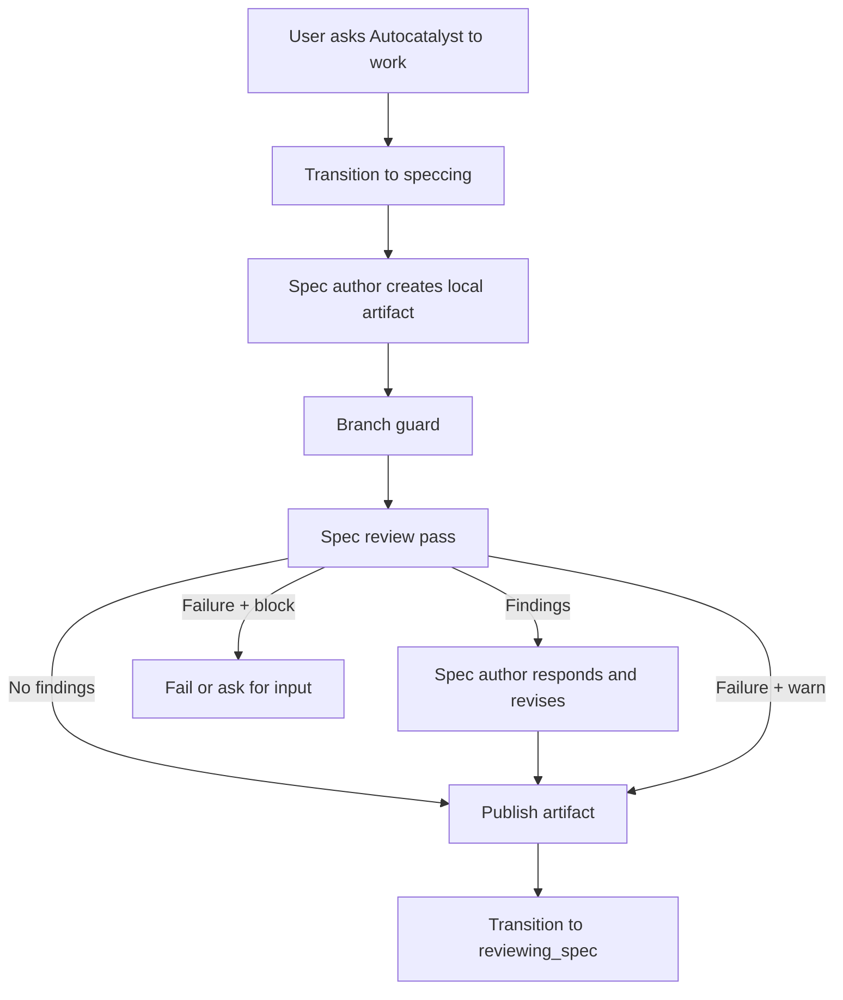
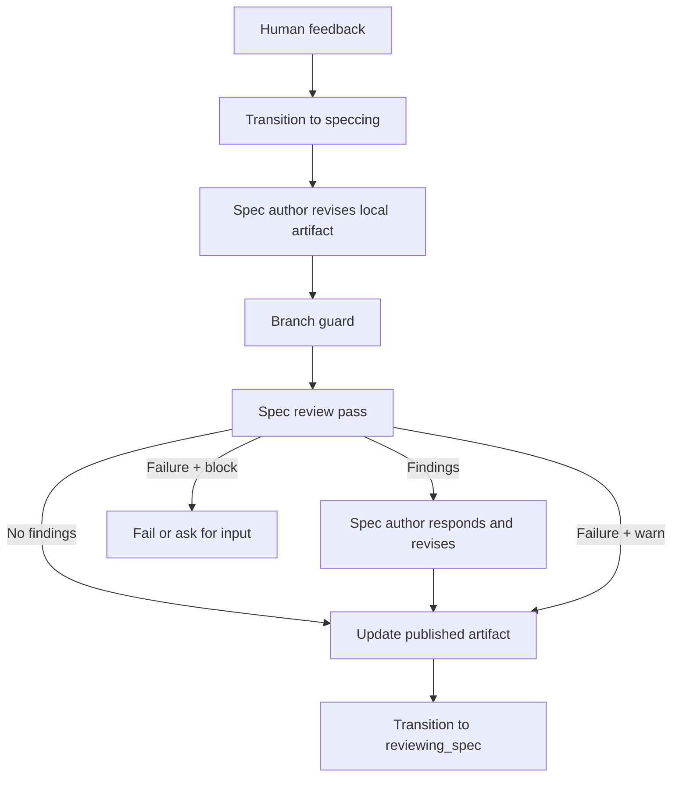

# Enhancement: Spec AI review pass

## Parent features

- `feature-idea-to-spec.md` — provides artifact generation, human spec review, and feedback-driven spec revision.
- `enhancement-notion-publisher.md` — provides artifact publication and in-place spec updates before human review.
- `enhancement-two-part-implementation-review.md` — provides the AI review coordinator pattern this enhancement mirrors for spec quality review.
- `enhancement-run-status-workspace-ai-context.md` — provides run AI-context reporting that should include spec review agent invocations.
## What

Autocatalyst runs an AI review pass on specs before publishing them for human review. The review pass runs after the spec author creates or revises the local artifact and after the branch guard confirms the workspace is still on the expected branch. It runs before Notion publication and before the run transitions to `reviewing_spec`.
The review model checks the spec for completeness, clarity, testability, feasibility, and `mm:planning` template conformance. If the review returns no findings, Autocatalyst publishes the spec as it does today. If the review returns findings, Autocatalyst sends them back to the spec author agent, requires a structured response for each finding, and only then publishes the updated spec.
The pass applies to both initial artifact creation and every feedback-driven revision. Review failures follow a configurable policy; the default is `warn`, which records and logs the degraded review but does not block the spec from reaching the human.
## Why

The implementation lifecycle already uses a separate AI review pass to catch code and test issues before humans spend time on implementation review. The spec lifecycle has no equivalent. A spec can move directly from authoring to human review even when it has vague acceptance criteria, missing testing guidance, contradictory requirements, or the wrong template structure.
That gap is costly because weak specs compound into weak implementations. A spec review pass catches problems while the authoring agent still has the full context and can revise the artifact before publication. It also creates a second line of defense against spec format drift, especially when generated specs stop matching `mm:planning` frontmatter, section order, or staged artifact structure.
## Goals

- Run a configurable AI review pass before initial specs are published to Notion or any artifact publisher.
- Run the same review pass before revised specs are republished after human feedback.
- Check generated specs for completeness, clarity, measurable acceptance criteria, implementation feasibility, specific testing guidance, and absence of contradictions.
- Add a template conformance gate that checks canonical frontmatter fields, required section presence, section ordering, and staged `mm:planning` structure.
- Return actionable findings to the spec author agent and require a structured `fixed`, `declined`, or `needs_input` response for each finding.
- Instruct the author agent to fully rewrite structurally non-conformant specs from a clean `mm:planning` template instead of patching them in place.
- Publish only the reviewed local artifact content to the human-facing artifact publisher.
- Preserve the existing branch guard behavior and run stage lifecycle.
- Make the review route and failure policy configurable, with safe defaults for new configurations.
- Add unit coverage for no-findings, findings-with-author-response, structural-rewrite, and degraded-review paths.
## Non-goals

- Replacing human spec approval.
- Giving the review model final authority over product decisions.
- Letting the review model edit the spec directly; it reports findings, and the authoring agent revises.
- Adding a new human UI for review findings in this enhancement.
- Running unbounded review/fix loops. This enhancement runs one reviewer pass and, when needed, one author response pass.
- Guaranteeing true read-only filesystem enforcement for every provider. Autocatalyst should prompt and configure the reviewer as read-only, but hard enforcement depends on the runner/provider.
- Changing the implementation review lifecycle.
## Personas

- **Phoebe: Product manager** — wants specs to reach her with clear scope, concrete acceptance criteria, and no obvious template or requirements gaps.
- **Enzo: Engineer** — wants AI-authored specs to include enough technical and testing detail for an implementation agent to build and verify the work without guessing.
- **Autocatalyst operator** — configures which AI profile reviews specs and chooses whether review failures warn or block.
## User stories

- As Phoebe, I receive a spec for review only after a critic model has checked it for ambiguous requirements and missing acceptance criteria.
- As Phoebe, I can leave feedback on a spec and know the revised spec receives the same quality check before it comes back to me.
- As Enzo, I can rely on specs to include measurable acceptance criteria and testing expectations before they enter implementation approval.
- As Enzo, I can see that structurally invalid specs are rewritten from the correct `mm:planning` template rather than patched into a hybrid format.
- As an operator, I can configure `spec.review` to use a different profile from `artifact.create` and `artifact.revise`.
- As an operator, I can set spec review failures to warn so a temporary review model problem does not block human review.
- As an operator, I can inspect logs and run AI context to see when the spec review model was invoked and whether it produced findings.
- As a spec author agent, I receive stable finding IDs and respond to each with `fixed`, `declined`, or `needs_input` before publication proceeds.
## Design changes

This is a backend lifecycle enhancement. The human-facing flow stays the same: the Slack thread still receives progress updates and a link to the published artifact when the spec is ready. The difference is that Autocatalyst performs an internal AI quality gate before that link appears.
### Lifecycle placement

Initial artifact creation becomes:

Feedback-driven revision becomes:

The branch guard remains before review. If the authoring agent changed branches, Autocatalyst fails before invoking the reviewer. The reviewer should therefore inspect the correct branch and workspace.
### Review dimensions

The review prompt must ask the reviewer to evaluate these dimensions:
1. **Completeness** — required sections are present for the artifact type, and each section contains substantive content.
2. **Clarity** — requirements are specific enough that an implementation agent does not need to infer core behavior.
3. **Testability** — acceptance criteria and testing guidance are measurable and runnable by an agent.
4. **Implementation feasibility** — proposed behavior has enough edge-case detail to implement safely.
5. **Consistency** — the spec has no contradictory requirements, mismatched scope, or stale copied content.
6. **Template conformance** — frontmatter, section order, and staged structure match `mm:planning` expectations.
### Template conformance gate

The reviewer must treat structural template drift as a distinct category. It checks:
- Frontmatter includes the canonical fields `created`, `last_updated`, `status`, `issue`, `specced_by`, `implemented_by`, and `superseded_by`.
- Frontmatter omits non-standard fields such as `type`, `source_issue`, `related_specs`, and `related_adrs`.
- The top-level heading follows the artifact type, such as `# Feature: ...` or `# Enhancement: ...`.
- The section order follows the canonical feature or enhancement template used by `mm:planning`.
- The spec does not collapse product requirements, design spec, tech spec, and task decomposition into one unreviewed monolithic pass when the staged workflow calls for separate sections.
When the reviewer detects structural non-conformance, it should return one high-severity finding with category `template_conformance` and `requires_full_rewrite: true`. The author response prompt must not ask the author to patch individual section or frontmatter items. It must instruct the author to:
1. Walk through `mm:planning` from first principles.
2. Write a clean replacement file at `-new.md`.
3. Use only the original draft's content to answer questions that would normally require human input.
4. Let the `mm:planning` template, not the original malformed structure, determine the new file structure.
5. Delete the malformed original after the replacement is complete.
6. Rename the replacement file to the original path.
This rewrite behavior avoids hybrid specs that keep parts of the wrong structure.
### Progress updates

Autocatalyst should post best-effort progress updates while the internal review runs:
```plain text
Spec draft complete — starting AI spec review with 
Spec review found no findings — publishing for review
Spec review returned 3 findings — asking the spec author to revise
Spec author addressed review feedback — publishing for review
Spec review failed; continuing because on_review_failure is warn
```
Progress update failures are non-blocking and logged with `event: 'progress_failed'` and `phase: 'spec_review'`.
### Review authority

The reviewer returns findings only. The authoring agent decides how to respond:
- `fixed` — the author changed the spec and explains what changed.
- `declined` — the author leaves the spec unchanged and gives a concrete reason.
- `needs_input` — the author cannot resolve the issue without a human decision.
A declined finding without a concrete reason is invalid. A `needs_input` response should keep the run out of `reviewing_spec` and surface the question to the human through the existing failure/input path selected by the handler implementation.
## Technical changes

### Affected files

- `src/types/ai.ts` — add `'spec.review'` to `AgentTaskKind`; add spec review result, finding, response, and exchange types.
- `src/types/config.ts` — add `SpecReviewPolicy` and optional `spec_review` config block, analogous to `ImplementationReviewPolicy`.
- `src/config/defaults.ts` — add a default spec review profile or route entry for `spec.review`.
- `autocatalyst.yaml` — add the repository's `spec.review` route key.
- `src/core/ai/agent-services.ts` — add `buildSpecReviewPrompt()`, `buildSpecAuthorResponsePrompt()`, and `parseSpecReviewResult()`.
- `src/core/ai/spec-review-coordinator.ts` — add `SpecReviewCoordinator` with `runSpecReview()`.
- `src/core/handlers/artifact-creation-handler.ts` — run spec review after branch guard and before `createArtifact()` / `reviewing_spec` transition.
- `src/core/handlers/artifact-feedback-handler.ts` — run spec review after branch guard and before `updateArtifact()` / `reviewing_spec` transition.
- `src/core/default-handler-registry.ts` and dependency wiring modules — construct and inject `SpecReviewCoordinator` where artifact handlers are assembled.
- `tests/core/ai/agent-services.test.ts` — cover spec review prompts, author response prompts, and review result parsing.
- `tests/core/ai/spec-review-coordinator.test.ts` — cover review flow behavior.
- `tests/core/handlers/artifact-creation-handler.test.ts` — cover review placement before first publication.
- `tests/core/handlers/artifact-feedback-handler.test.ts` — cover review placement before republishing revisions.
- `tests/core/config.test.ts` or routing policy tests — cover `spec.review` config and defaults.
### 1. Prerequisites and assumptions

- The existing artifact authoring agent writes local spec files and returns `artifact_path` for creation and revision workflows.
- The existing branch guard already runs after authoring and before publication in both artifact handlers.
- The implementation review coordinator proves the project accepts a reviewer/coordinator pattern that runs an agent, parses a JSON result file, and sends findings back to the authoring/implementation agent.
- The spec reviewer needs repository and workspace context, so `spec.review` should resolve to an agent-runner profile, not a direct chat-only profile.
- The author response pass can reuse `ArtifactAuthoringAgent.revise()` only if it can provide a synthetic feedback payload with review findings. If that creates awkward coupling to human comments, add a dedicated author response method instead.
- No new external dependency is required.
### 2. Config and routing

Add one AI route key:
```typescript
export type AgentTaskKind =
  | 'intent.classify'
  | 'artifact.create'
  | 'artifact.revise'
  | 'spec.review'
  | 'implementation.plan'
  | 'implementation.run'
  | 'implementation.review.initial'
  | 'implementation.review.final'
  | 'question.answer'
  | 'issue.triage'
  | 'pr.title_generate';
```
Example config:
```yaml
ai:
  routing:
    artifact.create: artifact-agent
    artifact.revise: artifact-agent
    spec.review: review-agent

spec_review:
  max_rounds: 1
  on_review_failure: warn # warn | block
  template_conformance: true
```
`SpecReviewPolicy`:
```typescript
export interface SpecReviewPolicy {
  max_rounds?: number;
  on_review_failure?: 'warn' | 'block';
  template_conformance?: boolean;
}
```
Defaults:
- `max_rounds: 1`
- `on_review_failure: warn`
- `template_conformance: true`
Compatibility rules:
- If `spec.review` is configured, Autocatalyst runs spec review for specs and spec revisions.
- If `spec.review` is absent, existing repositories preserve current behavior. Autocatalyst logs `spec.review.skipped` at warn level and publishes the spec without review.
- Generated default config includes `spec.review: review-agent` so new repositories receive the feature by default.
- If `spec_review.on_review_failure` is omitted, failures warn and publication proceeds.
### 3. Review result contract

The reviewer writes JSON to `.autocatalyst/spec-review-result.json` in the run workspace:
```typescript
export type SpecReviewFindingSeverity = 'blocker' | 'warning' | 'info';
export type SpecReviewFindingCategory =
  | 'completeness'
  | 'clarity'
  | 'testability'
  | 'feasibility'
  | 'consistency'
  | 'template_conformance';

export interface SpecReviewFinding {
  id: string;
  severity: SpecReviewFindingSeverity;
  category: SpecReviewFindingCategory;
  finding: string;
  suggested_action?: string;
  requires_full_rewrite?: boolean;
}

export interface SpecReviewResult {
  status: 'no_findings' | 'findings' | 'failed';
  summary: string;
  findings: SpecReviewFinding[];
  error?: string;
}
```
Rules:
- `status: 'no_findings'` must include an empty `findings` array.
- `status: 'findings'` must include at least one finding.
- Each finding must have a stable ID such as `SPEC-1`.
- `requires_full_rewrite` may be true only for `template_conformance` findings.
- `status: 'failed'` must include an `error` string.
- Parser validation should degrade invalid JSON to `status: 'failed'` with a clear error, matching `parseImplementationReviewResult()` behavior.
### 4. Author response contract

When findings exist, the authoring agent writes or updates the artifact and returns structured responses:
```typescript
export interface SpecReviewResponseItem {
  id: string;
  disposition: 'fixed' | 'declined' | 'needs_input';
  response: string;
}

export interface SpecReviewAuthorResponseResult {
  status: 'complete' | 'needs_input' | 'failed';
  responses: SpecReviewResponseItem[];
  question?: string;
  error?: string;
}
```
The response prompt must require one response for every finding ID. The coordinator validates that all IDs are present and that each response has a non-empty explanation. Missing or invalid responses are treated as `failed` or `needs_input`, depending on whether the author can still ask the human a concrete question.
For non-structural findings, the author may edit the original artifact in place. For `requires_full_rewrite` findings, the author must use the replacement-file flow described in the template conformance gate.
### 5. Coordinator design

Add `SpecReviewCoordinator`:
```typescript
export interface SpecReviewCoordinatorDeps {
  runner: AgentRunner;
  artifactAuthoringAgent: Pick;
  routingPolicy: AgentRoutingPolicy;
  policy: Required;
  logger: Pick;
  readFile?: (path: string, encoding: 'utf-8') => Promise;
}

export interface SpecReviewRunParams {
  run: Run;
  artifact_path: string;
  working_directory: string;
  artifact_kind: ArtifactKind;
  current_page_markdown?: string;
  onProgress?: (message: string) => Promise;
  onAgentRequest?: (metadata: AgentInvocationMetadata) => void;
}

export interface SpecReviewRunResult {
  status: 'complete' | 'needs_input' | 'failed';
  artifact_path: string;
  page_content?: string;
  summary?: string;
  question?: string;
  error?: string;
}
```
`runSpecReview()` flow:
1. Resolve `spec.review` through `routingPolicy.resolveOptional({ task: 'spec.review', artifact_kind })`.
2. If no profile exists, log `spec.review.skipped` and return `complete`.
3. Record agent request metadata with route `spec.review` and the resolved model.
4. Build a prompt that includes artifact path, artifact kind, workspace path, relevant `mm:planning` template rules, and explicit JSON output instructions.
5. Run the reviewer using `AgentRunner` and drain output with the same helper used by implementation review.
6. Read `.autocatalyst/spec-review-result.json` and parse it.
7. If parsing or runner execution fails, apply `on_review_failure`.
8. If no findings exist, log `spec.review.completed` and return `complete`.
9. If findings exist, post progress, build the author response prompt, and run the spec author response pass.
10. Validate author responses and branch state if the handler performs another guard after revision.
11. Return `complete`, `needs_input`, or `failed` to the handler.
The coordinator should not publish artifacts or transition run stages. Handlers keep lifecycle authority.
### 6. Handler integration

`ArtifactCreationHandler.handle()` changes after branch guard:
1. Author creates the local artifact.
2. Handler sets `run.artifact` to `drafting` as today.
3. Branch guard checks the workspace branch.
4. Handler invokes `specReviewCoordinator.runSpecReview()` when the dependency is configured and the artifact kind is spec-like.
5. If review returns `complete`, handler proceeds to `artifactPublisher.createArtifact()`.
6. If review returns `needs_input`, handler posts the question or fails through the existing run failure/input mechanism selected for spec authoring.
7. If review returns `failed`, handler fails the run when policy blocks; with `warn`, the coordinator returns `complete` and the handler proceeds.
`ArtifactFeedbackHandler.handle()` changes after branch guard and before `updateArtifact()`:
1. Author revises the local artifact using human feedback.
2. Branch guard checks the workspace branch.
3. Handler invokes `specReviewCoordinator.runSpecReview()` with `current_page_markdown` when available.
4. Handler uses returned `page_content` if the author response pass produced span-preserving content for Notion.
5. Handler updates the published artifact and comment replies only after the reviewed local artifact is ready.
6. Handler transitions to `reviewing_spec` after publication as today.
If the author response pass changes files, either the coordinator or handler must run branch guard again before publication. The preferred design is for the handler to run the existing guard after `runSpecReview()` returns `complete`, because handlers own branch safety today.
### 7. Prompt requirements

`buildSpecReviewPrompt()` must instruct the reviewer to:
- Read the artifact from `artifact_path`.
- Inspect nearby repository context only as needed.
- Treat `context-human/specs` and `mm:planning` structure as the source of template expectations.
- Check frontmatter fields and reject non-standard frontmatter fields.
- Check section order for feature versus enhancement specs.
- Check for measurable acceptance criteria and specific testing requirements.
- Return only structured JSON in `.autocatalyst/spec-review-result.json`.
- Avoid secrets and do not include environment values, tokens, or credentials.
`buildSpecAuthorResponsePrompt()` must instruct the author to:
- Address every finding ID.
- Preserve user-approved product intent.
- Make the smallest safe content changes unless a full rewrite is required.
- Use the full replacement-file flow for `requires_full_rewrite` findings.
- Return structured response JSON or a clearly delimited response block that the coordinator can parse.
- Never remove human comments or Notion comment spans from `page_content` when span-preserving markdown is supplied.
### 8. Logging and telemetry

Add structured logs:
- `spec.review.started` — review begins, including run ID and profile.
- `spec.review.round_started` — reviewer pass begins.
- `spec.review.round_completed` — reviewer pass completes, including finding counts by severity and category.
- `spec.review.completed` — no findings or addressed findings.
- `spec.review.findings_returned` — findings are sent to the author.
- `spec.review.author_response_completed` — author response pass completes.
- `spec.review.skipped` — route is missing.
- `spec.review.degraded` — reviewer failed and policy is `warn`.
- `spec.review.failed` — reviewer or author response failure blocks the run.
The coordinator must call `onAgentRequest` for the review agent so `ac-run-status` can show spec review model activity during `speccing` or `reviewing_spec` lifecycle windows.
### 9. Testing requirements

- Spec review runs after initial artifact creation branch guard and before `artifactPublisher.createArtifact()`.
- Spec review runs after every artifact revision branch guard and before `artifactPublisher.updateArtifact()`.
- When the review result is `no_findings`, publication proceeds without invoking the author response pass.
- When findings exist, the author response pass receives every finding and publication waits for the response.
- When a finding has `requires_full_rewrite: true`, the author prompt contains the full replacement-file instructions.
- When the reviewer writes invalid JSON, `parseSpecReviewResult()` returns `failed` with a useful error.
- When the reviewer errors and `spec_review.on_review_failure` is `warn`, the spec is still published and a degraded review is logged.
- When the reviewer errors and `spec_review.on_review_failure` is `block`, publication does not occur and the run fails or asks for input.
- When `spec.review` is missing from routing, existing publication behavior is preserved with a warning log.
- `spec.review` appears in generated default config and this repository's `autocatalyst.yaml`.
- Agent request metadata is recorded for review invocations.
- Branch guard still prevents publication if the author changed branches before review, and runs again after review-driven edits before publication.
## Implementation tasks

### Story 1: Configure spec review routing

**Description:** Add configuration and type support for routing a spec review agent.
**Tasks:**
- Add `'spec.review'` to `AgentTaskKind`.
- Add `SpecReviewPolicy` and `spec_review?: SpecReviewPolicy` to config types.
- Add default policy resolution where workflow config is loaded.
- Add `spec.review` to generated default config and `autocatalyst.yaml`.
- Add routing/default tests for configured and missing `spec.review` routes.
**Acceptance criteria:**
- TypeScript accepts `spec.review` anywhere an agent route is resolved.
- New generated configs include a review route by default.
- Existing configs without `spec.review` still load.
**Dependencies:** None.
### Story 2: Add spec review prompt builders and parser

**Description:** Teach agent services how to instruct the reviewer, instruct the author response pass, and parse review JSON.
**Tasks:**
- Add spec review finding/result/response types.
- Implement `buildSpecReviewPrompt()` with quality and template conformance dimensions.
- Implement `buildSpecAuthorResponsePrompt()` with normal-fix and full-rewrite instructions.
- Implement `parseSpecReviewResult()` with validation behavior matching implementation review parsing.
- Add unit tests for prompt content and parser edge cases.
**Acceptance criteria:**
- The review prompt requires JSON output at `.autocatalyst/spec-review-result.json`.
- The author response prompt includes the full rewrite flow when needed.
- Invalid JSON and invalid statuses produce `failed` results with useful errors.
**Dependencies:** Story 1.
### Story 3: Implement `SpecReviewCoordinator`

**Description:** Add the coordinator that runs the reviewer and, when needed, sends findings back to the spec author.
**Tasks:**
- Create `src/core/ai/spec-review-coordinator.ts`.
- Resolve the optional `spec.review` profile and skip safely when missing.
- Drain the review agent and parse `.autocatalyst/spec-review-result.json`.
- Apply `on_review_failure` policy.
- Invoke the author response pass when findings exist.
- Validate author responses and return `complete`, `needs_input`, or `failed`.
- Emit structured logs and progress updates.
- Record agent request metadata for run AI context.
**Acceptance criteria:**
- No-findings review returns `complete` without author response.
- Findings review invokes author response exactly once and requires all finding IDs to be addressed.
- Warn-mode reviewer failure returns `complete` and logs a degraded event.
- Block-mode reviewer failure returns `failed`.
**Dependencies:** Stories 1 and 2.
### Story 4: Integrate review into artifact creation and revision

**Description:** Run spec review in both spec lifecycle paths before human-facing publication.
**Tasks:**
- Inject `SpecReviewCoordinator` into `ArtifactCreationHandler` and `ArtifactFeedbackHandler` dependency wiring.
- Call `runSpecReview()` after branch guard in initial creation.
- Call `runSpecReview()` after branch guard in feedback revision.
- Run branch guard again after review-driven author edits before publication.
- Preserve existing publication, comment response, and status-transition behavior after successful review.
- Handle `needs_input` and `failed` coordinator results without publishing stale artifacts.
**Acceptance criteria:**
- Initial specs are reviewed before `createArtifact()`.
- Revised specs are reviewed before `updateArtifact()`.
- Publication still occurs for no-findings and warn-mode degraded review paths.
- Publication does not occur for blocking review failures or unresolved author responses.
**Dependencies:** Story 3.
### Story 5: Cover lifecycle behavior with tests

**Description:** Add targeted tests that prove review ordering, policy behavior, and branch safety.
**Tasks:**
- Add coordinator unit tests for no findings, findings, full rewrite prompt, warn failure, block failure, and missing route.
- Add creation handler tests that assert review runs after branch guard and before publication.
- Add feedback handler tests that assert review runs before republishing and preserves comment response flow.
- Add branch guard tests for review-driven edits before publication.
- Add config tests for defaults and backwards compatibility.
**Acceptance criteria:**
- Test failures clearly identify ordering regressions.
- The suite proves existing no-review config behavior still works.
- The suite proves `on_review_failure: warn` does not block publication.
**Dependencies:** Stories 1 through 4.